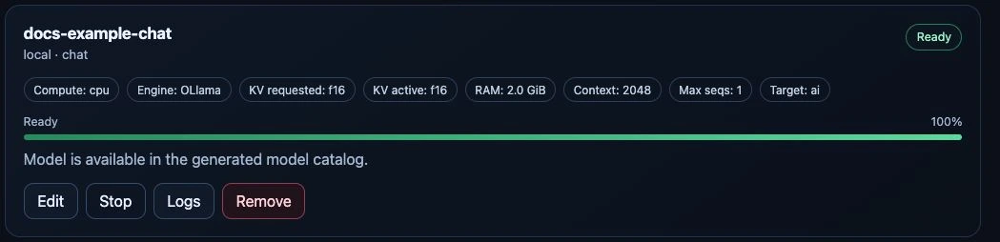
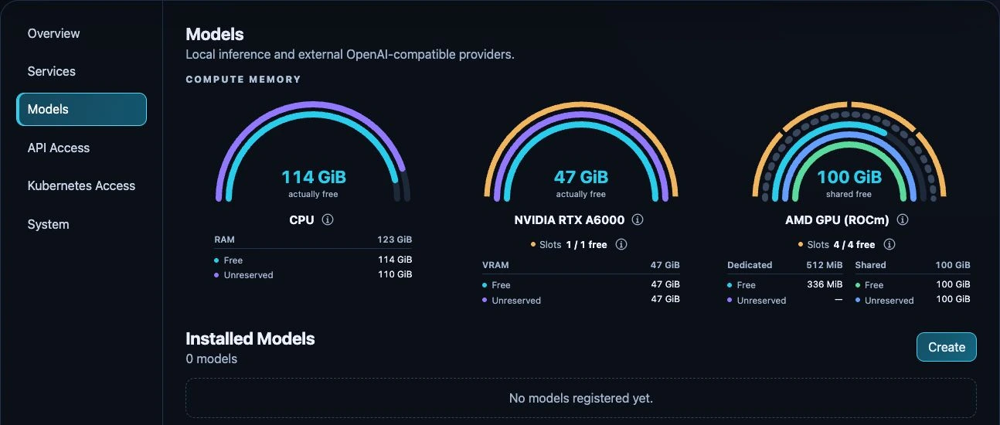

# Magic Stick

**Your hardware. Your AI. One place to run it.**

Magic Stick turns a dedicated server into a self-hosted AI appliance. Install
models, manage CPU and GPU resources, connect applications, and control access
from a shared dashboard — from the first installation to everyday operation.

It is software for your own infrastructure, not a hardware device or a hosted
AI subscription. Use the browser for routine tasks; use the CLI/TUI and
Kubernetes interfaces when you need deeper control.

[Website](https://qualityminds.github.io/AIppliance-Magic-Stick/) ·
[Handbook](https://qualityminds.github.io/AIppliance-Magic-Stick/handbook/) ·
[Get started](#installation) ·
[Hardware compatibility](docs/reference/compatibility.md) ·
[License and eligibility](LICENSING.md)

Source-available under **BSL 1.1**. Free production use is subject to the
[Additional Use Grant](LICENSE); other production use requires a commercial agreement.

## Why Magic Stick?

Running a model is only part of running private AI. You also need to know where
it fits, make it available to applications, give people access, and keep the
underlying computer manageable.

Magic Stick brings those tasks together for individuals and teams that want AI
on infrastructure they control. It combines established inference engines and
self-hosted applications with a common installation, management and access layer.
You do not have to treat each engine as a separate appliance.

## What you can do

- **Run and manage models.** Choose Ollama, vLLM or FreeToken on compatible
  hardware. Find a model, configure its resources, start or stop it, edit supported
  parameters and inspect runtime logs. [Model guide](docs/user-guide/models/manage.md)
- **Understand your resources.** See CPU/GPU memory and available allocation
  slots, choose eligible devices, and configure supported GPU-sharing modes.
  [GPU setup](docs/administration/gpu-setup.md)
- **Put models to work.** Use catalog applications for document knowledge, chat
  and coding-agent workflows, or connect your own application through the
  LiteLLM-backed OpenAI-compatible API.
  [Applications](docs/user-guide/applications.md) · [API access](docs/user-guide/api-access.md)
- **Give your team access.** Manage local users, groups and roles, named API keys,
  and application-sharing policies. Federated SSO is available with license
  activation. [Users and roles](docs/administration/users.md) ·
  [Sharing](docs/user-guide/sharing.md)
- **Share selected models across devices.** Opt into Private Mesh to make running
  local chat models available to enrolled appliances and companion clients.
  [Private Mesh](docs/user-guide/private-mesh.md)
- **Operate the computer, not just the model.** Manage supported host networking,
  Ubuntu update policies, model caches and hardware preparation from the dashboard.
  [Administration](docs/administration/README.md)

*Real test-appliance capture, 24 September 2026. The small documentation model
illustrates the controls, not recommended model settings. Stop retains its
configuration; Start brings it back when needed.*

## Installation

**Starting with a dedicated physical server? Download the prebuilt online image
from the [USB installation guide](docs/installation/bare-metal.md).** Verify its
checksum, write it to a USB drive and boot the server. No Git, Docker or local
image build is needed. The guide includes the current test-build status and
takes you from Ubuntu installation to a running Magic Stick appliance.

Read the [hardware and network requirements](docs/get-started/requirements.md)
first. Back up existing data and choose the route that matches your starting point:

| Your starting point | Installation guide | Scope |
|---|---|---|
| Dedicated physical server | [Download the online USB installer](docs/installation/bare-metal.md) | Ubuntu, host automation, K3s, Flux and Magic Stick |
| New virtual machine | [Cloud-init / autoinstall](docs/installation/cloud-init-vm.md) | Prepare an Ubuntu VM with host automation and Magic Stick |
| Existing dedicated Ubuntu host or VM | [Install on Ubuntu](docs/installation/existing-vm.md) | Add the platform without changing the Ubuntu release |
| Existing Kubernetes cluster | [Install in a cluster](docs/installation/existing-kubernetes.md) | Add cluster components; host administration remains yours |

The current new-installation baseline is Ubuntu 26.04; existing dedicated Ubuntu
24.04 hosts remain a legacy installation path. The linked guides include reviewed
scripts, preflight checks and prerequisites. The default installation reads the
public repository and needs neither a private Git repository nor a GitHub token.

Installation needs Internet access for packages, images and charts. Keep initial
setup on a trusted private network. Every route leads to the protected
[first administrator setup](docs/installation/first-run-setup.md); there is no
shared default dashboard password.

### From installation to your first response

1. **Finish setup and sign in.** Create the first administrator and
   [verify the appliance](docs/installation/verify.md).
2. **Open Models → Create.** Choose an engine and eligible compute target.
   Start with a small supported model and a modest context length.
3. **Wait for Ready.** The first start may download model files. Use **Logs** to
   follow initialization or investigate a failure.
4. **Try a request.** Use the LiteLLM Playground, a configured application, or
   your own client with a named API key.

Follow [your first model response](docs/get-started/first-model.md) for the full
walkthrough. External providers are also an option when you do not want local inference.

## Hardware and inference engines

A GPU is optional for the platform. Supported CPU models and external providers
are alternatives. Local engine availability depends on the device, host
architecture, drivers, model and available resources.

| Compute target | Configured engine paths |
|---|---|
| CPU | Ollama, vLLM |
| NVIDIA GPU | Ollama, vLLM, FreeToken on eligible devices |
| AMD GPU / ROCm | Ollama, vLLM |
| Intel GPU / XPU | vLLM |

This is an overview of configured paths, **not a guarantee for every card or
model**. Check the [catalog-derived compatibility reference](docs/reference/compatibility.md)
before choosing hardware. FreeToken has its own supported-device policy, memory
configuration and whole-GPU allocation requirements.

*Real test-appliance capture before installing the documentation model,
24 September 2026. Values illustrate one machine, not hardware requirements,
performance claims or memory-sizing recommendations.*

### Know the boundaries

- GPU sharing does not add physical VRAM or provide hard per-model memory
  isolation. Memory estimates are planning aids, not proof that a workload fits.
  [Memory concepts](docs/concepts/memory.md) · [GPU sharing](docs/administration/gpu-sharing.md)
- A local model can run on your infrastructure, but external providers and
  application integrations can send data elsewhere. Downloads also require
  network access; self-hosted does not automatically mean offline.
- Realtime is a separate **experimental vLLM-Omni path** with specific supported
  profiles. An OpenAI-compatible chat API does not imply audio or
  `/v1/realtime` support. [Realtime guide](docs/user-guide/models/realtime.md)
- Keep a recovery plan. There is no appliance-wide one-click backup/restore or
  factory reset, and platform updates do not upgrade the Ubuntu release.
  [Backup and recovery](docs/administration/backup-recovery.md)

## How it fits together

The dashboard manages models, applications and settings. The Magic Stick Operator
coordinates the required runtimes and application operators; LiteLLM provides
the common model-routing layer. Kubernetes and Flux supply the platform foundation.
Existing-cluster installations reuse your cluster rather than installing K3s.

The normal workflow stores your choices through the dashboard and runtime
resources. Advanced GitOps overlays are optional, not a prerequisite for using
the appliance. Read the [architecture guide](docs/concepts/architecture.md) for
the control flow, inference path and component responsibilities.

## Documentation

The handbook is written in English for users and administrators, with technical
detail kept in separate sections. The same Markdown is readable here on GitHub
and on the [searchable documentation website](https://qualityminds.github.io/AIppliance-Magic-Stick/handbook/).

| You want to… | Start here |
|---|---|
| Understand the product and try a model | [Get started](docs/get-started/README.md) |
| Install on a server, VM or cluster | [Installation](docs/installation/README.md) |
| Use models, applications and APIs | [User guide](docs/user-guide/README.md) |
| Manage users, hardware, networking and updates | [Administration](docs/administration/README.md) |
| Understand architecture, routing and memory | [Concepts](docs/concepts/README.md) |
| Look up compatibility, settings and APIs | [Reference](docs/reference/README.md) |
| Build, extend or contribute | [Development](docs/development/README.md) |

## License

Magic Stick's own source uses the [Business Source License 1.1](LICENSE)
(`BUSL-1.1`). It is **source-available, not an Open Source license**. Each version
changes to the MIT License three years after its first public distribution.

The Additional Use Grant permits eligible personal, non-profit, educational and
research use, and internal business use by groups with consolidated annual
revenue of at most EUR 2,000,000. Production use outside the grant requires a
commercial agreement. Productive third-party OEM/appliance, SaaS, hosting and
managed-service offerings where Magic Stick is material are excluded from the
free grant regardless of revenue. The precise terms are in
[LICENSE](LICENSE) and [LICENSING.md](LICENSING.md).

All core functions — including model engines, GPU management, Resource Sharing
and Private Mesh — work without a license file. **Only Federated SSO is
feature-gated**, through Free Registered or Commercial activation. A missing
license file is not proof that production use qualifies for the free grant.
See [license management](docs/administration/licenses.md).

Models, engines, applications and other third-party components retain their own
licenses. See [third-party notices](THIRD_PARTY_NOTICES.md) and the
[release audit](docs/development/license-audit.md).

## Community and security

- **Questions or problems:** follow the [support guide](SUPPORT.md). Support is
  best-effort; this repository does not promise response times or a support SLA.
- **Bugs and ideas:** open a [GitHub issue](https://github.com/QualityMinds/AIppliance-Magic-Stick/issues)
  with reproducible steps and redacted diagnostics.
- **Security issues:** use the reporting process in [SECURITY.md](SECURITY.md),
  not a public issue containing sensitive details.
- **Contributions:** read [CONTRIBUTING.md](CONTRIBUTING.md) and the
  [Code of Conduct](CODE_OF_CONDUCT.md).
- **Project direction:** see the [roadmap](ROADMAP.md), [changelog](CHANGELOG.md),
  [governance](GOVERNANCE.md) and [maintainers](MAINTAINERS.md).

Never publish credentials, kubeconfigs, private addresses, personal data or
unredacted deployment logs in issues or contributions. The public repository
contains reusable defaults and safe examples; deployment-specific values belong
in your own installation.

## For developers and integrators

Installer build scripts are [development tools](docs/development/installer-images.md#local-development-builds)
for custom media and testing. Normal installations use the prebuilt online image.

### Repository layout

| Directory | Responsibility |
|---|---|
| [`magic-installer/`](magic-installer/README.md) | Bootable USB media and Ubuntu autoinstall templates |
| [`magic-host/`](magic-host/README.md) | Host preparation and Ansible automation |
| [`magic-cluster/`](magic-cluster/README.md) | Platform, application, GPU and Flux resources |
| [`dashboard/`](dashboard/README.md) | Browser dashboard, authenticated API and CLI/TUI |
| [`core/`](core/) | Shared product logic, including licensing and Private Mesh |
| [`docs/`](docs/README.md) | User handbook, administration, reference and development guides |
| [`examples/demo/`](examples/README.md) | Render-only examples with public-safe values |

### Advanced integration

Use the canonical guides for [GitOps entry points and overlays](docs/development/gitops-overlays.md),
[host bootstrap and configuration](docs/reference/configuration.md),
[module lifecycle](docs/concepts/controllers.md),
[runtime resources](docs/reference/kubernetes-resources.md), and
[model catalog integration](docs/development/model-integration.md).
These describe the existing extension points; a private deployment repository
is not required by the default product path.

### Build and validation

Start with the [development environment](docs/development/environment.md) and
[build/test guide](docs/development/testing.md). Use the
[documentation checks](docs/development/documentation.md) for Markdown, images
and the static site, and follow the
[release checklist](docs/development/release-checklist.md) before publishing.
Repo-specific agent instructions are in [AGENTS.md](AGENTS.md).
