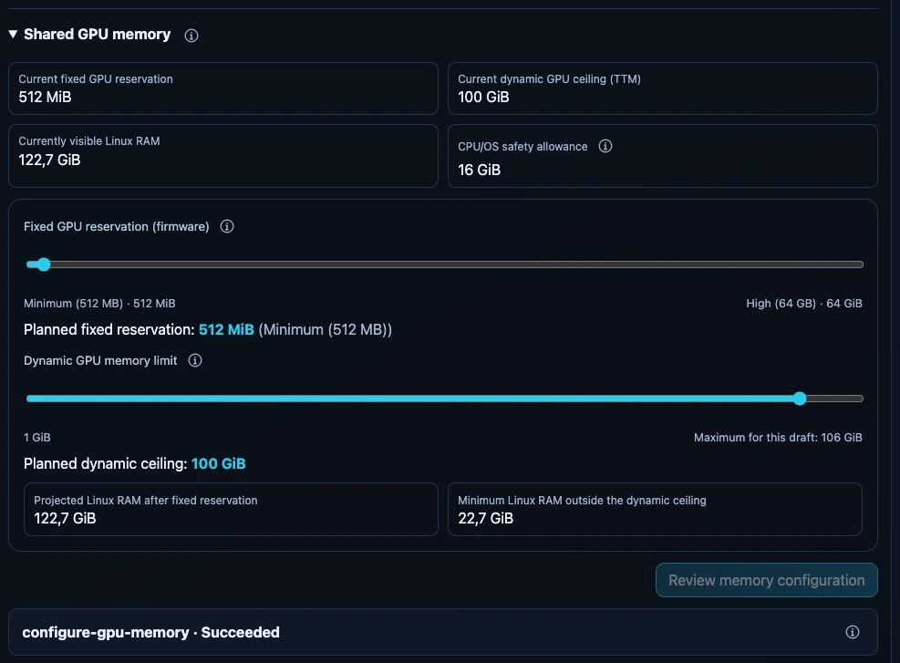

# Configure GPU memory

## Understand the numbers

Read [memory accounting](../concepts/memory.md) before changing a unified-memory
computer. The GPU's firmware reservation and dynamic limit are not two GPUs and
cannot simply be added into a guaranteed single-model capacity.

## Change a supported AMD shared-memory configuration

1. Open **System → Hardware**, the node, then its AMD GPU configuration.
2. Expand **Shared GPU memory**. Review current firmware reservation, dynamic
   ceiling, Linux-visible RAM and the CPU/OS safety allowance.
3. Adjust the offered controls. Firmware choices are supplied by the host; the
   dynamic maximum is bounded by the remaining Linux RAM and safety policy.
4. Review the projected layout and host operation. Retain local recovery access.
5. Confirm the exact computer name when prompted, then follow operation status
   through any restart. Do not submit a second change while one is pending.

*Read-only test-appliance capture, 24 September 2026. Review memory configuration
is disabled because the values have not changed. The existing Succeeded status
belongs to an earlier operation; no memory change or restart was performed for
this screenshot. These capacities are not recommended settings for other hosts.*

## Verify

Refresh after the host returns and compare the actual layout with the plan.
`Succeeded` means the worker verified that layout, not that every inference
engine or model has been validated. Run an optional engine test or a small model
request separately.

Mixed NVIDIA/AMD hardware is checked per eligible AMD device and host profile;
an unrelated NVIDIA card is not shared system RAM. Missing firmware controls,
unsupported layouts or another active host operation can still make the form
unavailable. Read its information tooltip and [host operation details](host-management.md).

There is no equivalent dashboard firmware-reservation slider for arbitrary
discrete GPUs. Model VRAM budgets do not repartition the hardware.
