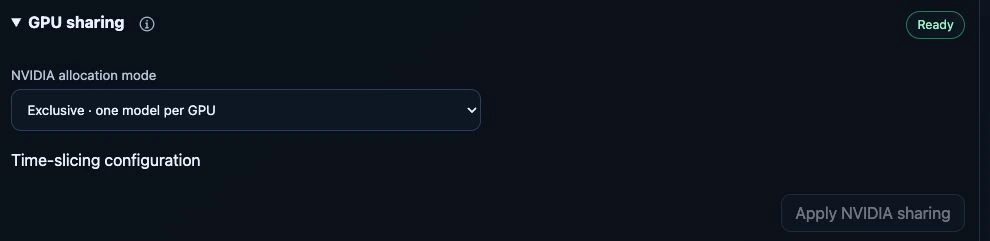
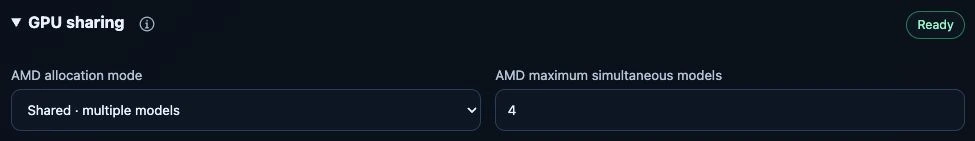

# GPU sharing and model slots

**System → Hardware → GPU nodes → GPUs → GPU Configuration AMD / NVIDIA → GPU sharing** provides the same administration
for AMD and NVIDIA: **Exclusive** or **Shared**, a model-slot limit, transition
status and explicit restart confirmation. The backend stays visible:

| Provider | Exclusive | Shared |
| --- | --- | --- |
| AMD | AMD device plugin | Experimental AMD DRA, one shared claim |
| NVIDIA | NVIDIA device plugin, one allocation | NVIDIA device-plugin time-slicing |

The settings are independent, including on mixed NVIDIA/Strix Halo hosts.
New installations use **Exclusive · one model per GPU** for both providers.
Merely opening Hardware does not change either provider. Apply is enabled only
when the selected mode or shared-model count differs from the current settings,
including configurations that were not saved through this dashboard. Reverting
an edit disables Apply again. The backend labels are **DRA sharing configuration**
and **Time-slicing configuration**; no extra sharing checkbox is required.
The final confirmation still explains model restarts and the lack of isolated
GPU memory. Physical GPU accordions contain their memory layout first, device
facts, then collapsed sharing controls. AMD runtime profile and shared-memory
controls stay with the matching AMD GPU. A provider's single-device sharing
form is never duplicated as independent controls on multiple same-vendor GPUs.
Both sections start collapsed and can be opened independently.
NVIDIA DRA, MIG and MPS are not enabled by these controls.

*Unchanged NVIDIA configuration on the test appliance, 24 September 2026.
Exclusive mode offers one model slot; opening this section did not apply a change.*

*Existing AMD shared configuration on the same test appliance, 24 September 2026.
Four slots are this device's saved setting, not the installation default or a
guarantee that four arbitrary models fit. No sharing transition was requested.*

## Model-slot accounting

Models shows a segmented outer GPU ring with free/total slots; memory rings
remain separate. Full GPUs are greyed out in the model form with a clear hint.
`GET /api/models` includes `slots` on GPU memory devices and compute targets,
plus engine-specific counts under `engineAvailability`. NVIDIA and exclusive
AMD capacity comes from Kubernetes allocatable resources; AMD DRA uses the
ready, node-identity-matched shared-claim limit. Desired but not yet ready DRA
configuration does not advertise usable slots.

Enabled model activations reserve their replica slots before Pods exist.
Matching KubeAI and direct Omni Pods replace those reservations, so they are not counted twice.
Other GPU Pods, including validation workloads and terminating Pods, also count;
completed Pods and deleted/disabled model intent do not. An enabled failed model
retains its slot for retries. Removing a model releases its slot once its Pod
has stopped. Slots are shared across engines, not inferred from RAM or VRAM.

Without confirmed physical placement, multiple GPUs on one node show a labelled
**Node slots** pool, not an invented per-device assignment. Unscheduled intent is
counted once per target and conservatively against eligible node/engine pools.
The API rechecks availability before model writes (existing models can reuse
their own slots). This is a scheduling snapshot, not an atomic Kubernetes
resource allocation; the scheduler and sharing-controller admission remain
authoritative if concurrent clients race for the last slot.

## Initial scope and limits

- One physical GPU on one selected, identity-checked node **per provider**.
  Multiple GPU nodes, multiple physical NVIDIA GPUs on that node and MIG are
  not managed by this first version; existing custom configurations are not
  silently adopted or overwritten.
- Model namespace `ai`, one replica per model, and 2–16 shared model slots.
  Exclusive NVIDIA mode admits one model. Additional models wait, ordered by
  creation time and name; disabling/removing a model releases its admission slot.
- AMD DRA requires Kubernetes 1.36 or newer, native mutating admission policies
  and CDI. Existing Strix Halo host/profile checks remain required.
- AMD DRA uses `ghcr.io/qualityminds/magicstick-amd-dra:v1.0.1-cdi-recovery.2`,
  based on upstream v1.0.1 commit `9eb4e2ea386e34581524b0110e24769654fcb8d2`.
  The AMD operator manages it instead of the mutually exclusive device plugin.
  The patch gives full GPUs a hardware-derived identity and restores volatile
  CDI files using this boot's device paths. Stale claims are quarantined without
  preventing registration or kubelet cleanup; see the recovery contract below.
  Publish the image with `build-amd-dra-image.yml` before deploying the reference.

This is cooperative sharing for trusted workloads. Models compete for compute,
bandwidth and memory. A slot is not a memory partition, a guaranteed throughput
share or a tenant-security boundary. Existing memory estimates, RAM requests and
risk warnings remain in force. A successful small test is not a guarantee that
two arbitrary large models fit together.

The [vLLM-Omni Realtime profiles](../reference/realtime.md#cooperative-gpu-sharing) accept both
sharing backends, using one slot per model and user-configured GPU-memory
budgets. Shared replicas cannot form a two-physical-GPU stage plan. This does
not change FreeToken's whole-GPU requirements. Omni planning estimates are
advisory for experimentation; real free-slot and device-binding checks remain.

## Common API and configuration

`GET /api/hardware/gpu-sharing` returns a `providers` array. Each entry includes
`provider`, `backend`, `mode` (`exclusive`/`shared`), `managed`, `experimental`,
availability, desired slot count, observed phase, node identity and admitted
models. AMD also reports its device PCI address and shared claim.
Administrator-only `POST /api/hardware/gpu-sharing` uses the normal CSRF checks,
`provider` (`amd`/`nvidia`), `mode`, `maxModels`, `nodeName`, `nodeUid`, the current
`expectedRevision`, `acknowledgeSharing` for shared mode and
`acknowledgeRestart`. The dashboard supplies these acknowledgements only after
the final confirmation, without a separate checkbox. The underlying AMD
integration retains its bounded opt-in and hardware checks; its `experimental`
API flag is not a label for Kubernetes DRA itself.
The API stores bounded JSON in the selected ModuleActivation's
`spec.parameters.gpuSharing`, not `Appliance.spec`:

- `amd-gpu`: internal mode `exclusive` or `dra-shared`.
- `gpu`: internal mode `exclusive` or `time-slicing`.

Generic module/profile edits preserve this separate setting; the dedicated API
is the only dashboard write path. `ModelActivation.status.gpuSharing` records
allocation mode and node, plus claim/PCI device for DRA. Model readiness remains
separate from configuration readiness.

## AMD backend

The operator stops only managed AMD KubeAI and Omni models before changing allocation
backends. It retains their activations and downloaded model data; CPU and NVIDIA
models are untouched. Unmanaged legacy AMD workloads block a backend change.
After the DRA driver publishes matching `ResourceSlices`, the operator creates
one namespaced `ResourceClaim` for the real device. Admitted models share it.

KubeAI's generated AMD resource profiles retain the existing CPU/RAM settings
and selected node. A native, fail-closed admission policy attaches the claim only
to marked AMD model Pods created by the KubeAI controller. An unadvertised
sentinel resource prevents CPU fallback if that adapter is absent. Neither CPU
nor NVIDIA profiles are rewritten by the AMD adapter.
The direct Omni Deployment attaches the same shared claim itself, with no
sentinel or admission shim and no extra `amd.com/gpu` request. Its admitted slot,
namespace, node UID and claim readiness are checked before creation.
The JSON patch uses plain JSON maps for claim-array values, with the composed
claim variable explicitly cast to `string` for CEL's homogeneous map typing. Typed CEL objects
inside those arrays can trigger a conversion panic in the Kubernetes 1.36 API
server before a Pod is stored. Validate the adapter with a server-side dry run
as the KubeAI ServiceAccount; checking policy creation alone is insufficient.

Optional Ollama/vLLM validation uses the same shared claim in `ai`, without
privileged workloads or GPU host-path mounts. Validation is manually requested
and does not gate normal GPU use.

## NVIDIA backend

NVIDIA keeps its existing GPU Operator, ClusterPolicy, driver and device plugin.
The shipped `time-slicing-config` ConfigMap contains immutable named profiles:
`magicstick-exclusive` and `magicstick-shared-2` through `magicstick-shared-16`.
The Helm default is `magicstick-exclusive`. The legacy two-slot `any` profile
remains available unchanged for existing installations. The operator switches only the
selected node's `nvidia.com/device-plugin.config` label; NVIDIA's config manager
reloads the named configuration. No external ConfigMap is overwritten.

Before a change, only managed NVIDIA KubeAI and Omni models are stopped. Their
activations/downloads remain, and AMD/CPU models are untouched. Unmanaged NVIDIA
GPU workloads block the change. The controller waits for a ready device-plugin
Pod, the selected configuration label, matching `nvidia.com/gpu.replicas` and
matching allocatable slots. Model profiles then request one `nvidia.com/gpu`
allocation on the selected node, retaining their runtime, CPU settings and
CPU-offloading RAM requests/limits. No DRA claim is added to NVIDIA Pods.

An existing MIG configuration, externally selected plugin profile or a
ClusterPolicy pointing to a different ConfigMap blocks management without
rewriting those settings. A changed node UID requires a fresh selection.
The general `mig.strategy=single`/`mixed` setting alone does not imply active
partitions: non-MIG cards with `mig.capable=false` remain eligible. MIG-capable
cards using those strategies need corroborated `all-disabled`/`success` state;
MIG resources, partition labels or a pending MIG configuration block management.

### Upgrading older NVIDIA defaults

Before reconciling the new Helm default on an older installation, inspect the
current ClusterPolicy, node profile label and advertised replica count. If the
node still inherits the former `any` profile and that existing allocation should
remain, pin `nvidia.com/device-plugin.config=any` on that node before the upgrade.
Retain existing explicit or custom node profiles; do not overwrite them or infer
a profile from an unknown configuration. New nodes without an explicit profile
use the exclusive default. Changing an existing allocation remains a separate,
confirmed Hardware action.

## Recovery and diagnostics

### Restart recovery and legacy migration

Full AMD GPU names derive from PCI address, vendor/device ID, partition profile
and sysfs `unique_id` when a nonzero value is available. The upstream KFD
location-derived ID is **not** treated as a hardware UUID. DRM `cardN` and
`renderDN` numbering is resolved from current discovery, never from the DRA name.
Without a hardware unique ID, the fallback identifies a PCI location and model,
not an indistinguishable replacement at the same slot. PCI/topology or identity
changes are not silently migrated. Partitioned AMD devices are outside this
Magic Stick sharing profile; legacy partition checkpoints fail closed.

Checkpointed claims now contain their physical identity. On restart the driver
regenerates CDI device nodes and permissions only for matching hardware. Invalid
claims lose their stale CDI files but retain their checkpoint entries until
kubelet calls Unprepare. The driver stays registered to process that cleanup.
Known affected GPUs are withheld from ResourceSlices; an old checkpoint without
physical identity conservatively withholds the whole AMD pool. Unprepare is
idempotent, including after loss of `/run/cdi`, and republishes inventory after
the last blocking claim has been released. No boot script clears checkpoints,
and the plugin never infers that a shared claim has no remaining consumers.
ResourceSlices publish the identity's SHA-256 digest to respect Kubernetes'
64-character attribute limit; the controller verifies it against the reported
hardware fields before creating a shared claim.

The controller hashes hardware identity, node UID and namespace for new shared
claim names. It retires older Magic Stick-owned claims only when their saved
selection matches, `reservedFor` is empty and no Pod references them. Deletion
uses UID and resourceVersion preconditions; a new claim waits until deletion is
observed. Active, terminating, foreign or differently selected claims are not
force-removed.
Existing models using legacy claims must first stop normally. A lost kubelet
checkpoint or uncertain consumer state requires operator review, not blind
automatic cleanup. API errors leave allocation blocked.

Publish the recovery.2 image before deploying the controller reference. The
first migration may briefly withhold AMD inventory while kubelet releases
legacy claims. Do not roll back to recovery.1 with new-format active checkpoints:
drain consumers and let kubelet unprepare all claims before downgrading.
NVIDIA's driver, allocations and time-slicing configuration are unchanged.

### Optional validation lifecycle

`ai-system/magicstick-gpu-validation-history` is a runtime-owned ConfigMap.
Before creating a diagnostic Job, the controller durably consumes its manual
request. Completed results and runtime image identity are saved before adding
a 300-second Job TTL. Deleted/interrupted Jobs are reported as failed rather
than recreated. A new explicit request is required to retry; host or image
changes make prior results stale. Both legacy AMD and per-device AMD/NVIDIA
diagnostics use this history. The legacy queue does not delete device-scoped
Jobs. Inference eligibility remains independent of optional diagnostics.

History updates use resourceVersion concurrency checks. If history is unavailable
or exceeds its 750,000-character safety bound, new diagnostics stop without
discarding consumed requests, deleting unarchived Jobs or disabling GPU driver
reconciliation. Export history before maintenance; do not clear it while saved
validation requests remain active, as that would remove their retry protection.

### Acceptance checks

The image build runs Linux Go tests for renumbered DRM nodes, missing/replaced
GPUs, legacy/malformed checkpoints, repeated Prepare/Unprepare and isolation of
known affected devices. Controller tests cover claim ownership, multiple/ending
consumers, API failures, UID-guarded migration and persistent diagnostic history.
An opt-in `MAGICSTICK_TEST_LIVE_DISCOVERY=1` Go test reads real AMD inventory while
keeping all checkpoint/CDI writes in temporary directories. It does not replace
the release gate: cold/warm boot on a mixed AMD/NVIDIA host, restored ResourceSlices,
normal shared-claim cleanup and successful model inference on both providers.

### Changing allocation mode

Select **Exclusive · one model per GPU** and confirm the restart. For AMD, the controller stops
managed AMD models, waits for claim consumers to release the GPU, removes its
shared claims and restores the device plugin before resuming models. The reverse
operation remains available if the selected hardware no longer qualifies.
Do not remove the DRA driver while its Pods are still terminating: Kubelet needs
the driver to unprepare their claims.
If host evidence temporarily becomes stale, new DRA model admission is blocked
but the driver stays on its selected node so existing claims can still be
released. An eligibility-label change must not tear down that driver first.

Inspect `compatibility.sharing` in the appliance's AMD operator status for
`Switching`, `Starting`, `Ready` or `Blocked`. Inspect the actual claim allocation
and Pod events if models remain pending. A `Blocked` sharing setup is reported
as `Degraded` / `GpuSharingBlocked` on the model, not as runtime startup. Inspect
Pod events and controller logs; an `amd.com/gpu` extended resource is
not expected while DRA owns allocation. The dashboard counts the physical DRA
device once, not once per model slot.

For NVIDIA, the same action selects `magicstick-exclusive`, waits for one
allocatable GPU slot and admits one model. Inspect
`Appliance.status.hardwareOperators.gpu.sharing`, the selected node label and
device-plugin/config-manager logs for progress. Neither path treats replicated
slots as additional physical GPUs. This is not a NVIDIA DRA migration; that
would require separate operator and hardware acceptance.

## Upstream references

- [AMD operator DRA integration](https://instinct.docs.amd.com/projects/gpu-operator/en/latest/dra/dra-driver.html)
- [AMD driver: multiple Pods sharing one claim](https://github.com/ROCm/k8s-gpu-dra-driver/blob/v1.0.1/example/example-multiple-pod-share.yaml)
- [Kubernetes mutating admission policies](https://kubernetes.io/docs/reference/access-authn-authz/mutating-admission-policy/)
- [NVIDIA time-slicing and per-node configuration](https://docs.nvidia.com/datacenter/cloud-native/gpu-operator/latest/gpu-sharing.html)
