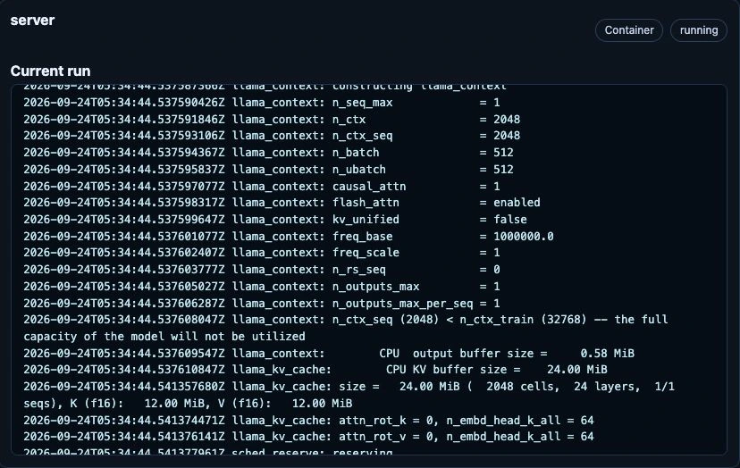

# Model startup and lifecycle

## Read runtime logs in the dashboard

1. Open **Models** and choose **Logs** on the affected model card.
2. Expand its Pod and inspect the relevant container's **Current run**. Previous
   output is also shown when available after a container restart.
3. Read the first actionable error, not only the final readiness timeout. Use
   **Refresh** for another bounded snapshot; this is not a complete log archive.
4. Review any copied output before sharing it. Logs can contain user input,
   credentials or internal addresses.

[](../../assets/screenshots/model-logs.webp)

*Live excerpt from the owner-authorized CPU test model, 24 September 2026. This
healthy initialization example shows where to inspect output, not an error or a
performance benchmark. Pod/host details, internal addresses and input content
are outside the crop.*

## Stop and resume models

In **Models → Installed Models**, operators and administrators can use **Stop**
for Ollama, vLLM (including Realtime), or FreeToken. This interrupts local inference and removes the
model's runtime without deleting its saved model definition or settings. Wait
for stopping to finish, then use **Start** to deploy the same configuration again.
GPU slots and CPU/GPU memory become available as the runtime Pods and allocations
are released, not necessarily as soon as the button is pressed. Starting again
can wait for capacity or download/initialization work; inspect the status and
**Logs** if needed.

FreeToken's Pod-local temporary model cache is deleted with its Pod, so Start may
download those weights again. Stopping does not clear shared persistent model
caches, credentials, or container images. External-provider Start/Stop controls
only the Magic Stick route, never the remote provider process. Use **Remove**
only when the saved activation itself should be deleted. See
[model lifecycle](../../reference/model-lifecycle.md#saved-model-lifecycle).

## Model Catalog

For a model blocked by `Insufficient cpu`, compare Pod **requests** with the
node's **allocatable** CPU, not just `kubectl top` usage. The model status now
includes `PodScheduled=False/Unschedulable` details. Automatic CPU requests
are independent of RAM/VRAM; the defaults and override fields are documented
in [CPU scheduling policy](../../reference/compute-targets.md#cpu-scheduling-policy).
After upgrading, confirm `status.cpuResources`, the final KubeAI count-one
resource profile and the Pod's actual requests/limits. Existing Pods are
replaced as the policy changes. Keep the host/Kubernetes reserve; do not
increase allocatable CPU to disguise excessive model requests. Check CPU use,
throttling and inference latency under real load before reducing requests
further or increasing a CPU-inference limit.

```bash
kubectl -n ai get configmap ai-model-catalog \
  -o jsonpath='{.data.AI_APPLIANCE_MODEL_CATALOG_READY}{"\n"}{.data.AI_APPLIANCE_MODEL_CATALOG_HASH}{"\n"}'

kubectl -n ai logs deploy/ai-model-catalog-controller
```

For schema details and model troubleshooting, see
[model-catalog.md](../../concepts/model-routing.md).

For a multimodal vLLM model that fails during vision-encoder profiling, inspect
the model Pod logs for the selected ViT backend and SDPA kernel warnings. A
large temporary attention allocation is distinct from the model's KV cache or
CPU scheduling request. On AMD, **Edit → Advanced → Deployment → Vision
attention backend** selects the alternatives documented in
[vision attention deployment](../../reference/compute-targets.md#vllm-vision-attention-deployment).
After an intentional change, verify the generated KubeAI Model args/env and
the new Pod's logs, then test both text and representative image requests.
Keep context and memory budgets fixed when comparing backends. Check actual
peak memory and output correctness; Ready alone is insufficient. Explicit
**Automatic** removes the managed manual overrides; it may restore the same
SDPA fallback that caused the original failure. Do not automatically switch
all existing models or treat an untested backend as a capacity guarantee.

## Operations

Inspect generated catalog status:

```bash
kubectl -n ai get configmap ai-model-catalog \
  -o jsonpath='{.data.AI_APPLIANCE_MODEL_CATALOG_READY}{"\n"}{.data.AI_APPLIANCE_MODEL_CATALOG_HASH}{"\n"}'
```

View available chat models:

```bash
kubectl -n ai get configmap ai-model-catalog \
  -o jsonpath='{.data.chat-models\.json}' | jq .
```

Check controller logs:

```bash
kubectl -n ai logs deploy/ai-model-catalog-controller
```

Common failure modes:

| Symptom | Check |
|---|---|
| `AI_APPLIANCE_MODEL_CATALOG_READY=false` | Controller has not completed a successful reconcile; check controller logs and LiteLLM reachability. |
| External model missing | Confirm `ai-external-models.data["models.json"]` is valid JSON and the entry is not `enabled: false`. |
| Default model is empty or unexpected | Confirm the requested default id exists and has the expected `chat` or `embedding` type. |
| Consumer app still uses old model data | Confirm the pod has the consumer label or annotation, or restart the app after the catalog hash changes. |
| Secret-backed external model fails | Confirm the referenced Secret and key exist in namespace `ai`; the controller needs to read the Secret value to sync LiteLLM. |
