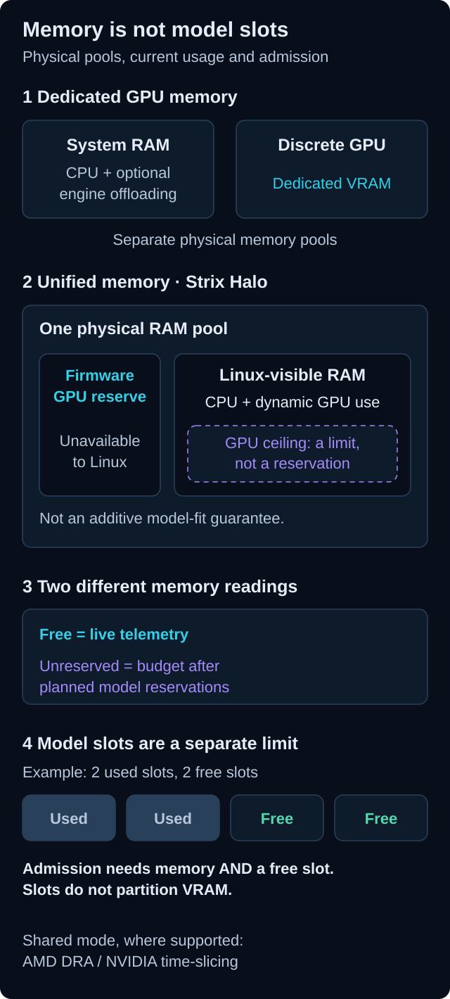

# Memory and resource accounting

[](../assets/diagrams/memory-and-sharing.svg)

*Conceptual layout, not to scale. The four model slots are an illustration, not
a default or a hardware recommendation. Open the diagram for full-size labels.*

## Capacity, free memory and unreserved budget

- **Capacity** describes a device or memory pool reported by the host/driver.
- **Free** is current telemetry. Another process can change it immediately.
- **Unreserved** subtracts planned model reservations. It is scheduling/accounting
  information, not proof that physical memory is unused.
- **Slots** count admitted models. They are independent of bytes and are not GPUs.

A model can be blocked by either a full slot budget or insufficient usable memory.
Its download and startup also need disk and CPU resources. Stopping a model releases
resources only when its runtime and allocations have actually terminated.

## Dedicated and shared GPU memory

A discrete GPU usually has dedicated VRAM. On a unified-memory system such as
Strix Halo, firmware-reserved GPU memory is unavailable to Linux, while dynamic GPU
allocations use Linux-visible RAM. The dynamic ceiling is an upper bound, not RAM
protected from CPU processes.

The shared-free estimate must respect both limits:

```text
shared free = max(0, min(Linux MemAvailable, shared ceiling - GPU occupancy))
```

If usable GPU occupancy telemetry is unknown, the dashboard must not claim that
the entire shared ceiling is free. Firmware and dynamic pools are not two GPU
deployment targets and cannot be blindly summed into a model-fit guarantee.

## Engine budgets

vLLM/Ollama memory estimates include model and context/runtime assumptions.
Supported CPU offloading uses host RAM on the selected GPU node, not memory from
another node or an implicit disk-swap pool. FreeToken maps its own memory settings
to runtime parameters and Kubernetes Pod resources. GPU budgets are not universal
hardware-enforced VRAM partitions.

For actions, see [GPU memory](../administration/gpu-memory.md),
[GPU sharing](../administration/gpu-sharing.md) and [engine selection](../user-guide/models/choose-engine.md).
