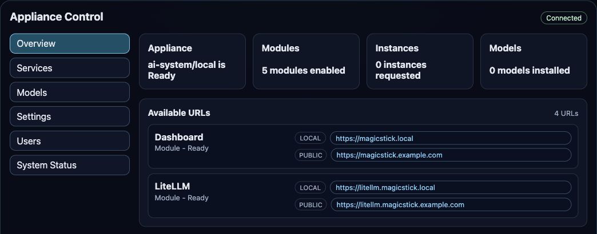
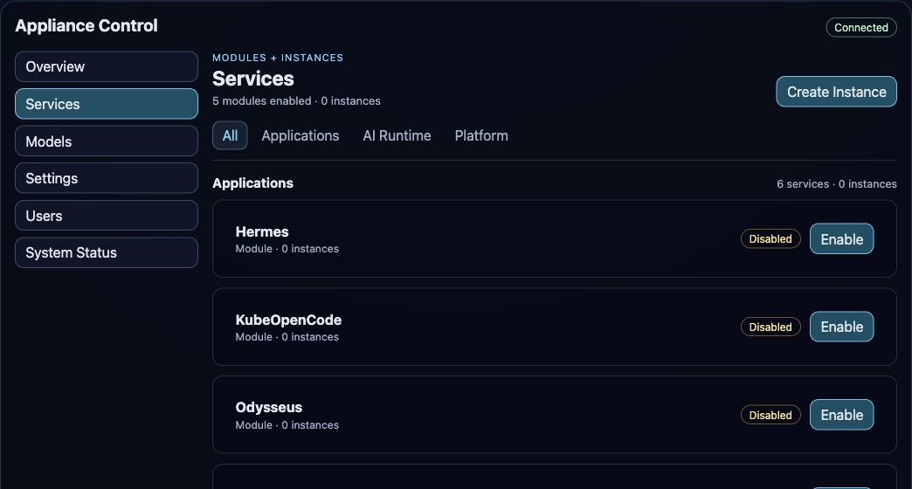
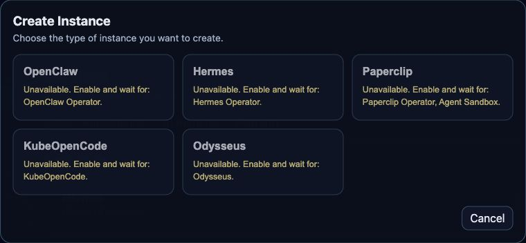
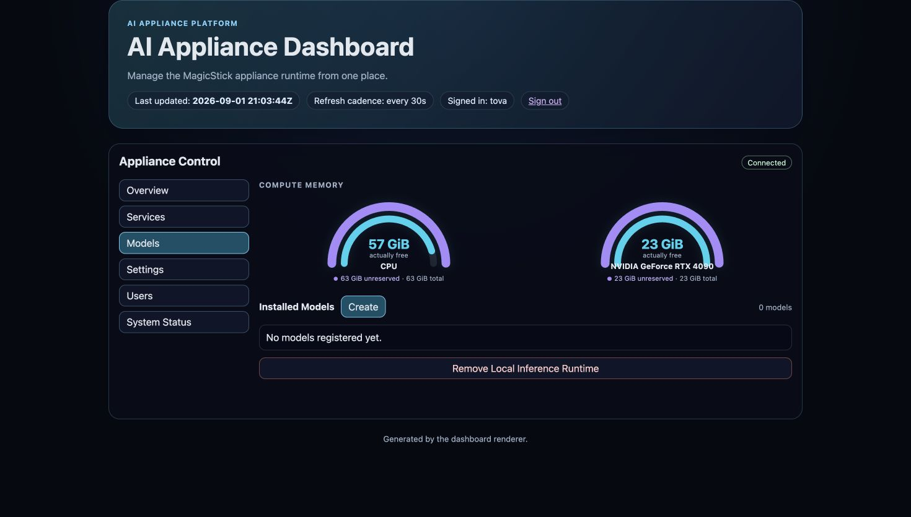
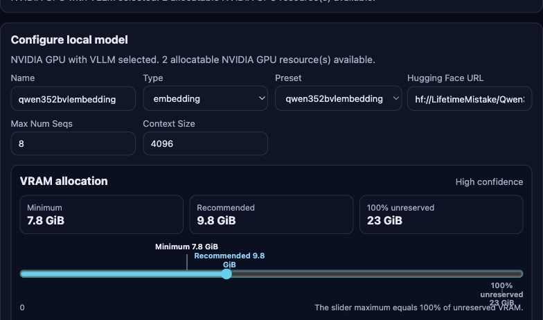
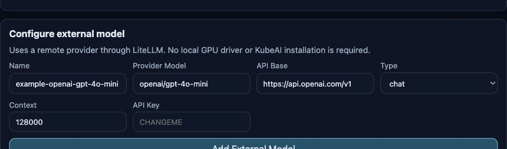
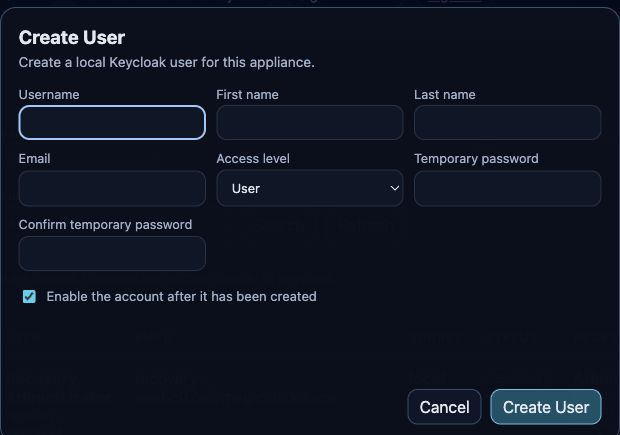
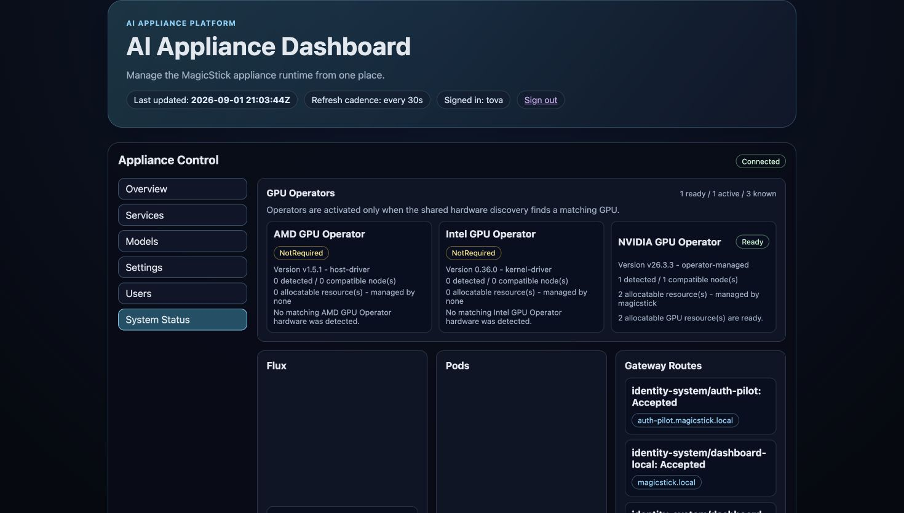
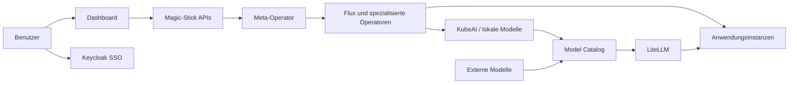

# Magic Stick – Funktionsübersicht

Magic Stick ist eine offene, lokal betreibbare KI-Plattform. Sie verbindet die
Installation eines Kubernetes-basierten Systems mit Identität, Modellen,
Anwendungen, Hardwareerkennung und laufendem Betrieb. Lokale Inferenz kann auf
CPU oder unterstützten GPUs stattfinden; externe OpenAI-kompatible Modelle
lassen sich parallel verwenden.

Diese Übersicht beschreibt den Funktionsumfang des aktuellen Repository-Stands.
Funktionen, die nur als mögliche Enterprise-Erweiterung vorgesehen sind, stehen
gesondert im Abschnitt [Geplante Enterprise-Erweiterungen](#geplante-enterprise-erweiterungen).

## Auf einen Blick

| Bereich | Funktionen |
|---|---|
| Installation | Bare Metal per USB, neue VM per cloud-init, bestehendes Ubuntu 24.04 und bestehendes Kubernetes |
| Sichere Ersteinrichtung | Geschützter First-Run ohne Standardpasswort, lokaler Einrichtungscode, erster Administrator und Recovery-Administrator |
| Plattform | Kubernetes oder K3s, Flux GitOps, deklarative Magic-Stick-APIs und Meta-Operator |
| Identität | Lokales Keycloak-SSO, lokale Benutzer, Rollen, optionales Upstream-OIDC/SAML und geschützte Anwendungsrouten |
| Modelle | Lokale und externe Modelle, Presets, Hugging-Face- und Ollama-Referenzen, gemeinsamer OpenAI-kompatibler Zugriff |
| Inferenz | vLLM auf CPU, NVIDIA, AMD und Intel; Ollama auf CPU, NVIDIA und AMD |
| Hardware | Automatische Erkennung, bedarfsgesteuerte GPU-Operatoren und Speicherübersicht für CPU und GPUs |
| Anwendungen | AnythingLLM sowie mehrere Instanzen von OpenClaw, Hermes, Paperclip, KubeOpenCode und Odysseus |
| Administration | Dashboard für Services, Modelle, Benutzer, API-Schlüssel, Kubernetes-Zugriff, Einstellungen und Systemstatus |
| Betrieb | Status- und Fehlerbedingungen, URL-Erkennung, Flux- und Pod-Sicht, sichere Deaktivierung und deklaratives Cleanup |

## Vier Installationswege, ein Zielzustand

Magic Stick kann passend zur vorhandenen Infrastruktur gestartet werden:

1. **Leerer physischer Server:** Der USB-Installer installiert Ubuntu, K3s,
   Flux und Magic Stick.
2. **Neue virtuelle Maschine:** Das cloud-init-/Autoinstall-Profil installiert
   Host-Automation, K3s, Flux und Magic Stick, zum Beispiel in einer Cloud-VM.
3. **Bestehender dedizierter Ubuntu-24.04-Host:**
   `install-from-linux.sh` prüft den Host und führt die vollständige Installation
   aus.
4. **Bestehendes Kubernetes-Cluster:** `deploy-on-k8s.sh` beziehungsweise
   `deploy-on-k8s.ps1` installiert die Flux-verwalteten Cluster-Komponenten,
   ohne den Host oder das vorhandene Kubernetes zu ersetzen.

Die Ein-Kommando-Skripte besitzen einen Preflight-Modus, zeigen den gewählten
Kubernetes-Kontext beziehungsweise Git-Stand und brechen bei konfliktträchtigen
Bestandsinstallationen ab. Installationen werden auf einen aufgelösten Git-Commit
fixiert, damit der ausgerollte Stand reproduzierbar bleibt.

Auf einem von Magic Stick verwalteten Host halten Ansible und ein wiederholbarer
Converge-Runner den Hostzustand aktuell. Im Standardmodus liest Flux das
öffentliche Repository ohne Git-Schreibrecht und ohne Git-Zugangstoken. Ein
externes GitOps-Repository kann optional per Overlay eingebunden werden.

Weiterführend: [Installationsübersicht](installation/README.md)

## Geschützte Ersteinrichtung

Neue Installationen erzeugen bewusst **kein Standardpasswort**. Stattdessen
startet ein temporärer First-Run:

- Zugriff über `https://magicstick.local` oder eine private IP-Fallback-Adresse,
- achtstelliger Einrichtungscode und TLS-Fingerabdruck; bei hostbasierten
  Installationen auf einer eigenen lokalen Konsole, beim bestehenden
  Kubernetes-Cluster im Installationsskript,
- Beschränkung des Setup-Gateways auf private, ULA- und Link-Local-Netze,
- Eingabe von Appliance-Name, `.local`-Name, Sprache, Zeitzone und optionaler
  öffentlicher Domain,
- Anlage des ersten Administrators sowie eines geschützten
  Recovery-Administrators,
- einmalige Ausgabe des Recovery-Codes,
- automatische Entfernung von Claim, temporärem Zertifikat, Setup-Route und
  Setup-Sitzung nach erfolgreichem Abschluss.

Der Setup-Zustand wird deklarativ als `ApplianceSetup` geführt und kann die
Phasen `Pending`, `Claimed`, `Applying`, `Completed`, `Failed` oder
`CompletedLegacy` melden.

Bei hostbasierten Installationen läuft die aufgeräumte First-Run-Ansicht
getrennt von den Installationslogs auf einer eigenen virtuellen Konsole. Vor
Abschluss kann ein Administrator dort den lokalen Claim mit
`magicstick setup show` erneut anzeigen oder mit `magicstick setup reissue`
sicher erneuern. Die Installation auf ein bestehendes Kubernetes-Cluster
verändert keine Node-Konsole und gibt den Claim stattdessen im ausführenden
Installationsskript aus.

Weiterführend: [First-Run Setup](first-run-setup.md)

## Zentrales Dashboard

Das Dashboard bildet den aktuellen Clusterzustand ab und verwaltet nur die
Ressourcen, die Magic Stick besitzt. Das Browser-Frontend erhält dabei keinen
Kubernetes-ServiceAccount-Token; Änderungen laufen über eine API mit eng
begrenzten Berechtigungen.

Die rollenabhängig sichtbaren Bereiche sind **Overview**, **Services**,
**Models**, **Settings**, **Users**, **API Access**, **Kubernetes Access** und
**System Status**.

### Übersicht

Die Übersicht zeigt:

- Zustand und Git-Revision der Appliance,
- Anzahl aktivierter Module, angeforderter Instanzen und installierter Modelle,
- lokale, öffentliche und direkte URLs der verfügbaren Anwendungen,
- aktuell erforderliche Aufmerksamkeit und verständliche Wartemeldungen.

### Services: Module und Instanzen in einer Ansicht

Die Services-Seite vereint Plattformmodule, Operatoren und Anwendungen. Sie
stellt Abhängigkeiten, Aktivierungszustand, Revision und vorhandene Instanzen
zusammen dar. Instanzlisten lassen sich pro Anwendung ein- und ausklappen.

Funktionen der Services-Seite:

- Filter nach Kategorien und Zustand,
- Module aktivieren, konfigurieren und sicher deaktivieren,
- Abhängigkeiten und fehlende CRDs erkennen,
- mehrere benannte Instanzen derselben Anwendung erzeugen,
- Instanzstatus, Zugriff, Modellzuordnung, Speicher und URLs anzeigen,
- nur die Optionen der ausgewählten Anwendung im Erstellungsdialog zeigen,
- Zugangsdaten nur für ausdrücklich unterstützte Module oder Instanzen abrufen.

Der Screenshot zeigt den Anwendungskatalog. Ob ein Typ auswählbar ist, hängt
vom Zustand seiner erforderlichen Module und CRDs ab.

### Einstellungen

Administratoren können die öffentliche Domain und die mDNS-Domain verwalten.
Der öffentliche Dashboard-Hostname und die daraus abgeleiteten Routen werden
konsistent aus diesen Einstellungen erzeugt.

## Module

Magic Stick trennt die portable Basis von optionalen oder
hardwareabhängigen Funktionen.

### Basis und zentrale Dienste

| Modul | Aufgabe |
|---|---|
| Basis | Gemeinsame Namespaces, Plattformgrundlagen und Clustervertrag |
| Hardware Discovery | Node Feature Discovery und Hardwaremerkmale für den Operator |
| Dashboard | Weboberfläche und eng begrenzte Verwaltungs-API |
| LiteLLM | Gemeinsamer OpenAI-kompatibler Gateway, Modellrouting, Browser-UI und virtuelle API-Schlüssel |
| Model Catalog | Synchronisiert lokale und externe Modelle für Anwendungen und LiteLLM |

### Optionale KI- und Anwendungsdienste

| Modul | Aufgabe |
|---|---|
| AnythingLLM | Self-hosted Wissens-, Dokumenten- und Chat-Arbeitsbereich mit Qdrant und den im Model Catalog bereitgestellten Modellen |
| KubeAI | On-Demand-Laufzeit für lokale vLLM- und Ollama-Modelle |
| OpenClaw Operator | Deklarativer Lebenszyklus von OpenClaw-Instanzen |
| Hermes Operator | Deklarativer Lebenszyklus von Hermes-Instanzen |
| Paperclip Operator | Deklarativer Lebenszyklus von Paperclip-Instanzen |
| Agent Sandbox | Isolierte Kubernetes-Sandboxes für Agenten- und CLI-Laufzeiten |
| KubeOpenCode | Kubernetes-native Coding-Agenten, Aufgaben und Zeitpläne |
| Odysseus | Agenten-Anwendung mit deklarativer Instanz- und Modellkonfiguration |

### Hardwareabhängige Module

| Modul | Aktivierung und Aufgabe |
|---|---|
| NVIDIA GPU Operator | Wird für erkannte, unterstützte NVIDIA-Hardware angefordert, veröffentlicht `nvidia.com/gpu` und unterstützt die katalogisierte Time-Slicing-Konfiguration |
| AMD GPU Operator | Wird für erkannte, unterstützte AMD-Hardware angefordert; verwendet in der portablen Basis den Host- beziehungsweise Inbox-`amdgpu`-Treiber |
| Intel Device Plugins Operator | Wird für erkannte, unterstützte Intel-GPUs angefordert und veröffentlicht XPU-/i915-Ressourcen |

Der gemeinsame Hardware-Discovery-Dienst aktualisiert die Erkennung regelmäßig.
Ein reiner CPU-Host muss keinen der drei GPU-Operatoren betreiben. Temporär
fehlende Labels lösen nicht sofort eine Deinstallation aus; ein ausdrücklich
deaktivierter Operator bleibt dagegen deaktiviert.

Weiterführend: [Modulkatalog](modules.md) und
[Operator-Orchestrierung](operator-orchestration.md)

## Anwendungen und Instanzen

Anwendungen werden unabhängig von ihrer Plattforminstallation als benannte
`AppInstance`-Ressourcen verwaltet. So können mehrere Vorhaben oder
Nutzungskontexte getrennte Instanzen derselben Anwendung betreiben.

| Anwendung | Aktueller Integrationsumfang |
|---|---|
| OpenClaw | Operator-verwaltete Instanzen, gemeinsames Modellrouting und optional abrufbares Gateway-Token |
| Hermes | Operator-verwaltete Instanzen mit Browser-Chat, separatem In-Cluster-Agent-Gateway, ausgewähltem Modell und SSO-geschützter Route |
| Paperclip | Companies, Agents, Tasks und Runs mit isolierten Kubernetes-Sandboxes, OpenCode-Runtime, Quotas, NetworkPolicies und optionalem lokalem Administrator |
| KubeOpenCode | Coding-Agenten mit Vorlagen, Aufgaben, Cron-Aufgaben, Registry und gemeinsamem Modellzugriff |
| Odysseus | Direkt durch Magic Stick gerenderte Workloads; ausgewähltes Modell wird idempotent registriert |

Pro Instanz können – abhängig vom Anwendungstyp – Name, Modell, Zugangsstufe,
Exposition, Speicher und anwendungsspezifische Werte gesetzt werden. Lokale und
öffentliche Hostnamen folgen dem Muster
`<instanz>.<anwendung>.<domain>`. Fehlende Module werden automatisch angefordert;
eine ausdrücklich deaktivierte Abhängigkeit führt sichtbar zu
`WaitingForModules`, statt sie stillschweigend zu überschreiben.

AnythingLLM ist im aktuellen Vertrag ein einzelnes Modul und keine
mehrfach instanziierbare `AppInstance`.

## Lokale und externe Modelle

Die Models-Seite vereint Hardwarekapazität, lokale Inferenz und externe
Provider. Beim Erstellen bleiben die Auswahlfelder sichtbar: zuerst der Ort,
dann die Inference Engine und anschließend nur die aktuell verfügbare Hardware.

### Unterstützte lokale Kombinationen

| Engine | CPU | NVIDIA GPU | AMD GPU (ROCm) | Intel GPU (XPU) |
|---|:---:|:---:|:---:|:---:|
| vLLM | Ja | Ja | Ja | Ja |
| Ollama | Ja | Ja | Ja | Noch nicht freigegeben |

Die Auswahl zeigt nur Kombinationen, für die im Cluster ein kompatibler und
betriebsbereiter Compute-Target vorhanden ist. CPU-Modelle funktionieren ohne
GPU-Treiber. Ein GPU-Modell wird erst angeboten, wenn der passende Provider
eine nutzbare Kubernetes-Ressource veröffentlicht.

CPU- und NVIDIA-Targets sind für `amd64` und `arm64` katalogisiert. Die
aktuellen AMD- und Intel-Targets verwenden `amd64`. KubeAI wird erst mit dem
ersten lokalen Modell angefordert; ein Beschleuniger-Modell fordert zusätzlich
den passenden Hardwareprovider an.

### Lokale Modellkonfiguration

Lokale Modelle unterstützen:

- Presets sowie benutzerdefinierte Hugging-Face-Referenzen (`hf://...`) für
  vLLM,
- Ollama-Modellreferenzen (`ollama://...`),
- Chat- und Embedding-Typen,
- Kontextgröße, maximale parallele Sequenzen und Ausgabelimit,
- explizite CPU-RAM- oder GPU-Speicherreservierung,
- hergeleitete Minimum- und Recommended-Werte,
- ein ausklappbares Breakdown aus Gewichten, KV-Cache und Laufzeitreserve.

Für vLLM nutzt die Schätzung öffentliche Hugging-Face-Gewichts- und
Architekturmetadaten. Für Ollama werden die Modell-Layer aus dem öffentlichen
Registry-Manifest berücksichtigt. Kontextgröße und parallele Sequenzen fließen
in die KV-Cache-Schätzung ein. Das Dashboard plant in 100-MiB-Schritten.

Die Speicheranzeige unterscheidet pro CPU beziehungsweise GPU:

- **Gesamt:** physischer Speicher,
- **unreserviert:** Gesamt minus Kubernetes-Reservierungen,
- **tatsächlich frei:** aktuell vom System gemeldeter freier Speicher.

Der Regler endet bei 100 Prozent des unreservierten Speichers. Liegen Minimum
oder Empfehlung darüber, erscheinen die Markierungen im ausgegrauten
Überlaufbereich. Die gewählte CPU-Reservierung wird als Kubernetes Memory
Request des Modell-Pods umgesetzt; GPU-Budgets werden in das jeweilige
Laufzeitprofil übersetzt.

### Externe Modelle

Externe OpenAI-kompatible Provider benötigen keine lokale GPU und können
parallel zu lokalen Modellen verwendet werden. Konfiguriert werden Name,
Provider-Modell, API-Basis, Typ, Kontextgröße und API-Schlüssel. Der Schlüssel
wird in einem Kubernetes Secret gespeichert und nicht in öffentliche
Konfigurationen geschrieben.

### Gemeinsamer Modellzugriff

Der Model Catalog veröffentlicht lokale und externe Modelle zentral. LiteLLM
stellt sie über eine gemeinsame OpenAI-kompatible Schnittstelle bereit. Der
Katalog erzeugt anwendungsspezifische Konfigurationsfragmente für AnythingLLM,
OpenClaw, Hermes, Paperclip und KubeOpenCode. Eine Odysseus-Instanz registriert
ihr ausgewähltes Modell beim Start idempotent über LiteLLM. Ein lokales Modell
wird erst als `Ready` gemeldet, wenn sowohl die Inference-Laufzeit als auch die
Veröffentlichung im Katalog erfolgreich sind.

Beim Entfernen eines Modells werden seine Aktivierung und ein von Magic Stick
angelegtes Provider-Secret aufgeräumt. Das Compute-Target eines bestehenden
Modells ist absichtlich unveränderlich; für den Wechsel von CPU zu GPU oder zu
einem anderen GPU-Typ wird das Modell neu angelegt.

Weiterführend: [Model Catalog](model-catalog.md)

## Benutzer, SSO und Rollen

Magic Stick verwendet Keycloak als lokale Identitätsplattform. Die Appliance
kann vollständig offline mit lokalen Konten betrieben oder als Identity Broker
mit einem vorhandenen OIDC-/SAML-Provider verbunden werden. Die konkreten
Upstream-Provider werden in Keycloak beziehungsweise im Deployment konfiguriert.

### Rollen

| Rolle | Bedeutung |
|---|---|
| User | Zugriff auf freigegebene Anwendungen |
| Viewer | Lesender Zugriff auf Dashboard und Status |
| Operator | Betrieb von Modulen, Instanzen, Modellen und unterstützten Zugangsdaten |
| Administrator | Benutzer, Sicherheit, Einstellungen, API-Zugriff und Kubernetes-Zugriff |

Jede `AppInstance` kann zusätzlich eine minimale Rolle verlangen. Eine
Anwendung kann nur dann absichtlich ohne Anmeldung veröffentlicht werden, wenn
dies in ihrer Instanzkonfiguration ausdrücklich gewählt wurde.

### Benutzerverwaltung

Administratoren können Benutzer suchen und seitenweise anzeigen sowie:

- lokale Konten erstellen,
- Namen, E-Mail und Magic-Stick-Rolle bearbeiten,
- Konten aktivieren und deaktivieren,
- ein temporäres Passwort für die nächste Anmeldung setzen,
- lokale Konten löschen,
- bereits über einen Identity Broker erschienene Benutzer verwalten, ohne deren
  extern gepflegte Profildaten zu überschreiben.

Schutzregeln verhindern unter anderem das versehentliche Entfernen des letzten
aktiven Administrators, die Selbst-Deaktivierung sowie kritische Änderungen am
Recovery-Konto. Kennwörter werden nicht aus Keycloak ausgelesen oder im
Kubernetes-Status gespeichert.

### Sitzungen und Routen

- SSO-konfigurierte lokale und öffentliche Browserrouten werden durch Envoy
  Gateway geschützt; eine Instanz kann ausdrücklich ohne SSO freigegeben
  werden.
- HTTP wird auf HTTPS umgeleitet.
- Das Dashboard validiert Identität und Rollen serverseitig.
- Die Verwaltungs-API prüft Benutzer und Rollen live. Bei sensiblen Änderungen
  wird zusätzlich ein Keycloak-Logout angefordert; bereits ausgestellte
  Edge-JWTs können bis zu ihrem Ablauf gültig bleiben.
- LiteLLM behält zusätzlich seine anwendungsspezifische API-Authentifizierung;
  Browser-SSO ersetzt keinen API-Schlüssel.
- Streaming-Routen besitzen keinen kurzen Gateway-Request-Timeout, damit lange
  Modellantworten nicht an der Browserroute abgeschnitten werden.

Weiterführend: [Authentifizierung und SSO](authentication.md)

## API Access

Der nur für Administratoren sichtbare Tab **API Access** verwaltet benannte
LiteLLM Virtual Keys:

- mehrere Schlüssel mit frei wählbarem Namen erstellen,
- gekürzte Schlüsselkennung, Erstellungszeit und Status anzeigen,
- den vollständigen `sk-...`-Wert genau einmal nach der Erstellung anzeigen,
- Schlüssel widerrufen und bei Bedarf durch einen neuen ersetzen,
- nur von Magic Stick angelegte Schlüssel über diese Oberfläche verwalten.

Die Listenansicht enthält ausschließlich Metadaten. Ein verlorener Rohschlüssel
kann nicht erneut angezeigt werden. Der aktuelle Vertrag erlaubt allen über den
gemeinsamen Katalog veröffentlichten Modellgruppen; feinere Budgets,
Ablaufzeiten und Modellbeschränkungen sind noch nicht Teil der Oberfläche.

## Kubernetes Access

Der Administrator-Tab **Kubernetes Access** verteilt Kubernetes-Zugriff über
SSO, ohne statische Tokens oder Passwörter in eine Kubeconfig einzubetten:

- Zugriff für vorhandene Keycloak-Benutzer aktivieren oder entfernen,
- Rollen **Viewer**, **Operator** oder **Cluster Administrator** zuweisen,
- eine OIDC-Kubeconfig herunterladen,
- dieselbe Kubeconfig direkt in die Zwischenablage kopieren,
- öffentliche Zertifikate, Issuer und OIDC-Clientdaten einbetten,
- für OpenLens und lokale Clients die erreichbare private Control-Plane-Adresse
  verwenden.

Die Kubeconfig nutzt `kubectl oidc-login` für die interaktive Anmeldung. Viewer
erhalten lesenden Clusterzugriff. Operatoren dürfen Magic-Stick-Runtime-CRs im
verwalteten Namespace ändern, aber keine beliebigen Deployments oder Secrets.
Cluster Administrator entspricht bewusst dem weitreichenden Kubernetes-
`cluster-admin` und sollte nur gezielt vergeben werden.

## Hardwareerkennung und Systemstatus

Die Seite **System Status** trennt installierte Software von tatsächlich
nutzbarer Hardware. Ein Hardwareprovider gilt nicht allein deshalb als bereit,
weil sein Flux-Paket angewendet wurde: Für `Ready` muss die erwartete
Kubernetes-GPU-Ressource veröffentlicht sein. Die NVIDIA-Karte auf der
**Services**-Seite bleibt zusätzlich bis zur verfügbaren DCGM-Telemetrie auf
`Installing`.

Angezeigt werden:

- NVIDIA-, AMD- und Intel-Hardwareprovider mit `NotRequired`, `Installing`,
  `Ready`, `Unknown` oder Fehlerzustand,
- Flux Kustomizations und deren angewendete Revision,
- Pods, Services, HTTPRoutes beziehungsweise Ingress-Ressourcen,
- relevante Kubernetes-Ereignisse,
- verständliche Hinweise bei fehlender Hardware, Telemetrie, CRD oder
  Abhängigkeit.

## Deklarative APIs und GitOps

Magic Stick verwendet Kubernetes-Ressourcen als nachvollziehbaren Vertrag:

| API | Zweck |
|---|---|
| `Appliance` | Appliance-weite Domains, Einstellungen und gewünschter GitOps-Zustand |
| `ModuleActivation` | Aktivierung und Konfiguration eines katalogisierten Moduls |
| `ModelActivation` | Lokales oder externes Modell, Engine, Compute-Target und Laufzeitparameter |
| `AppInstance` | Benannte Anwendung, Modell, Zugriff, Speicher und anwendungsspezifische Werte |
| `ApplianceSetup` | Geschützter First-Run und dessen Status |

Der Magic-Stick-Meta-Operator übersetzt diese Absicht in Flux Kustomizations,
HelmReleases, KubeAI-Modelle oder spezialisierte Operator-Ressourcen. Dadurch
bleiben Dashboard-Aktionen deklarativ, wiederholbar und im Kubernetes-Status
sichtbar.

Wichtige Lebenszyklusfunktionen:

- katalogbasierte Validierung statt fest im Frontend codierter Listen,
- Abhängigkeiten und CRDs vor dem Start einer Instanz prüfen,
- eindeutige Conditions und Fehlermeldungen an das Dashboard zurückgeben,
- deaktivierte Ressourcen mit Flux `prune` und definiertem Löschverhalten
  abbauen,
- Datenhaltung abhängig vom Modul beziehungsweise der Instanz bewusst erhalten
  oder entfernen,
- manuell erzeugte Aktivierungen beim Entfernen einer lokalen Laufzeit nicht
  versehentlich löschen.

Weiterführend: [Architektur](architecture.md),
[Appliance API](appliance-crd.md) und
[Operator-Orchestrierung](operator-orchestration.md)

## Betrieb und Fehlersuche

Für den täglichen Betrieb stellt Magic Stick bereit:

- konsolidierte Readiness von Appliance, Modulen, Modellen und Instanzen,
- direkte lokale und öffentliche URLs auf der Overview-Seite,
- Flux-Revisionen und Reconciliation-Zustände,
- Pod-Neustarts, Events und Routenübersicht,
- Statusmeldungen für wartende Modelle und fehlende Hardware,
- dokumentierte Prüfungen für Host, K3s/Kubernetes, Flux, Storage, GPU und
  Anwendungsrouten,
- idempotente Konfiguration, sodass ein erneuter Reconcile nicht dieselben
  Daten oder Modelle mehrfach registriert.

Weiterführend: [Betrieb und Troubleshooting](operations.md)

## Open Source und Erweiterbarkeit

Der Repository-Inhalt steht unter der [MIT-Lizenz](../LICENSE). Kataloge,
Kubernetes-APIs, Kustomize-Basen, Helm-Integration, Ansible-Hostautomation,
Installationsskripte und Dashboard sind offen einsehbar und anpassbar.

Die Architektur ist erweiterbar über:

- neue Module im Module Catalog,
- weitere App-Typen im App Catalog,
- neue Modell-Presets und Compute-Targets,
- zusätzliche Deployment-Overlays,
- externe GitOps-Repositories, die diese öffentliche Vorlage einbinden.

## Aktuelle Grenzen

Die folgenden Grenzen sind bewusst Teil des aktuellen Funktionsstands:

- Ein lokal auf einer GPU betriebenes Modell belegt derzeit genau eine GPU.
  Mehrere GPUs können unterschiedliche Modelle ausführen;
  Tensor-Parallelismus beziehungsweise das Aufteilen eines Modells auf mehrere
  GPUs ist in den aktuellen Presets nicht vorgesehen.
- Ollama auf Intel XPU wird erst angeboten, wenn ein validiertes
  KubeAI-/Ollama-Intel-Image vorhanden ist.
- Vulkan ist im aktuellen Compute-Target-Katalog nicht enthalten.
- Hardwareerkennung ersetzt nicht die Support-Matrix des jeweiligen
  GPU-Operators und installiert keine ungeprüften Treiberkombinationen.
- Freier AMD- oder Intel-GPU-Speicher kann nur angezeigt werden, wenn die
  passende Telemetrie im Cluster verfügbar ist.
- API-Schlüssel unterstützen derzeit keine individuellen Modelllisten, Budgets,
  Ablaufzeiten oder Team-Zuordnung.
- Die offenen Rollen sind applianceweit; die Mindestrolle einer Instanz
  unterscheidet Zugriffsstufen, aber noch keine individuellen Teamfreigaben.
- Ein Preset beschreibt eine orchestrierbare Konfiguration. Es bedeutet nicht,
  dass das Modell bereits heruntergeladen oder auf jeder möglichen Hardware
  live validiert wurde.
- Ein vollständiger Factory-Reset-Workflow ist noch nicht Bestandteil der
  Produktoberfläche.

## Geplante Enterprise-Erweiterungen

Die folgenden Punkte sind **nicht Teil des hier beschriebenen aktuellen
Open-Source-Funktionsstands**. Sie sind mögliche Enterprise-Erweiterungen auf
Anfrage:

- konkrete Benutzer oder Gruppen nur bestimmten Modulen, Instanzen oder
  Modellen zuordnen,
- Organisationsbereiche, Mandanten und delegierte Administration,
- Synchronisation von IdP-Gruppen in ressourcenspezifische Berechtigungen,
- zentrale Richtlinien, Freigabeprozesse und erweiterte Auditfunktionen.

Die bereits vorhandenen globalen Rollen `User`, `Viewer`, `Operator` und
`Administrator` sowie die Mindestrolle pro Instanz bleiben davon klar
getrennt.

## Weiterführende Dokumentation

- [Dokumentationsindex](README.md)
- [Installation](installation/README.md)
- [Dashboard](dashboard.md)
- [Authentifizierung](authentication.md)
- [Architektur](architecture.md)
- [Module](modules.md)
- [Model Catalog](model-catalog.md)
- [Betrieb](operations.md)
- [Konfiguration](configuration.md)
- [Entwicklung und Release-Prüfungen](development.md)
