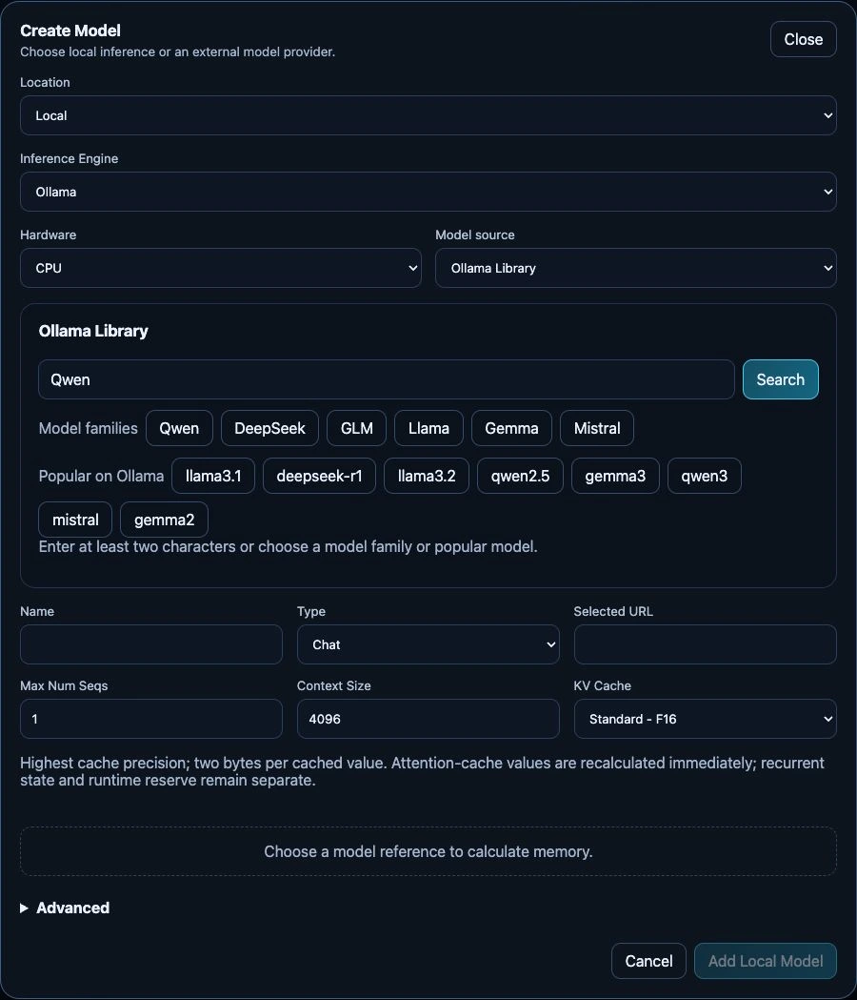

# Your first model response

## Before you start

Complete [first administrator setup](../installation/first-run-setup.md), sign in,
and [verify the installation](../installation/verify.md). You need Operator or
Administrator access to create a model. An administrator creates API keys.

## 1. Choose a route

Open **Models → Create**. Use a small model for the first test.

- **Local:** select an engine and an available compute target. CPU is an option
  for supported Ollama/vLLM models; an eligible GPU is not required for every engine.
- **External:** supply an existing provider endpoint, model identifier and credential.
  This avoids local inference memory requirements but sends requests to that provider.

See [choose an inference engine](../user-guide/models/choose-engine.md) if unsure.

*The unsubmitted Create Model form on the test appliance, captured 24 September
2026. No model has been selected yet, so the memory estimate and Add Local Model
action are not available. The fields change with the selected engine.*

## 2. Configure and create

For a local model, choose a compatible registry result/tag or a direct reference.
Review the selected artifact, context length, concurrency and memory budget.
For the first test, keep concurrency at one and choose a modest context rather
than the model's largest advertised window. FreeToken has a separate memory form.

Create the model and wait for **Ready**. The first start may download large files.
Use **Logs** on the model card to distinguish downloading, initialization and failure.
Do not repeatedly remove and recreate a model merely because a download takes time.

## 3. Send a request

Open **API Access** as an administrator, copy the displayed endpoint and create a
named key. Store the one-time key privately. Use that endpoint and the deployed
model name in your OpenAI-compatible client. The exact key scope and endpoint
are shown by the appliance; do not use the dashboard login password as an API key.

Alternatively, open LiteLLM from **Services** and use its Playground with the
ready model. A successful request is the first acceptance check; **Ready** alone
does not prove your full application workload.

## If it does not work

- GPU unavailable: read its disabled reason and inspect **System → Hardware**.
- No free slots: stop another model deliberately or review sharing; do not inflate memory.
- Download failure: check model access, disk space and network connectivity.
- Out of memory: reduce context/concurrency or choose a smaller artifact.

Continue with [model lifecycle](../user-guide/models/manage.md),
[applications](../user-guide/applications.md), or [troubleshooting](../administration/troubleshooting/overview.md).
