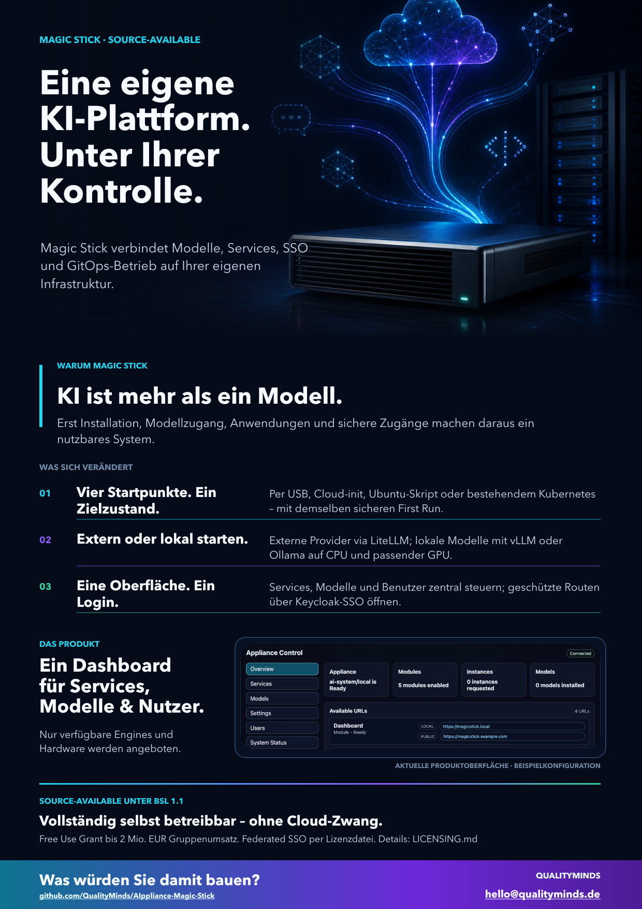
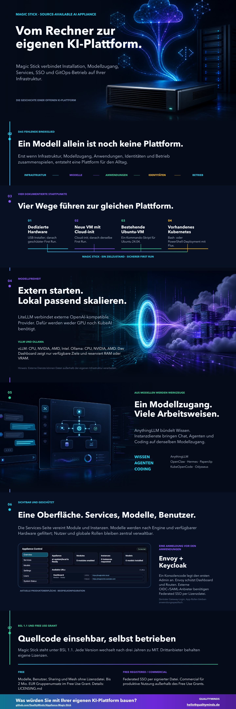

# Magic Stick Sales Deck

This folder contains the German presentation and marketing material for the
AIppliance Magic Stick. It presents the source-available appliance, its local-first
operating model and the Free, Free Registered and Commercial editions for
customer, partner and pilot conversations. The license summary is subordinate
to [LICENSE](../../LICENSE) and [LICENSING.md](../../LICENSING.md).

## Downloads

- [PowerPoint](Magic-Stick-Salesdeck-Dark-DE.pptx)
- [PDF](Magic-Stick-Salesdeck-Dark-DE.pdf)

## Marketing deck

The 20-slide marketing deck is the broadest presentation in this folder. It is
designed for product introductions, partner conversations, events, and pilot
workshops where the audience should understand both the product experience and
the platform argument. It combines current product captures with installation,
security, inference, application, GitOps and licensing themes.

- [Editable PowerPoint](Magic-Stick-Marketingdeck-DE.pptx)

## Marketing onepage

The portrait one-page version explains at a glance what Magic Stick is, what
changes for its users, and how BSL 1.1 and optional Federated SSO work.
It combines a product promise, three concrete
outcomes, and a real dashboard capture in a single shareable page.

- [Editable PowerPoint](Magic-Stick-Onepager-DE.pptx)
- [Shareable PDF](Magic-Stick-Onepager-DE.pdf)

## Long-form infographic

The vertical infographic tells the longer product story: from supported
starting points and model access to useful tools, central administration,
gateway SSO and the Free Use Grant. Federated SSO requires a Free Registered or
Commercial license file. Local identity, Sharing and Mesh do not.

- [Editable PowerPoint](Magic-Stick-Infografik-DE.pptx)
- [Long-format PDF](Magic-Stick-Infografik-DE.pdf)

## Storyline

The 13-slide deck covers:

1. the integration challenge behind productive AI;
2. one dashboard for services, models, users, and system status;
3. four entry points: USB, cloud-init, an existing Ubuntu host, or an existing
   Kubernetes cluster;
4. protected first-run setup without a default human password;
5. external providers through LiteLLM and local inference through KubeAI;
6. vLLM on CPU, NVIDIA, AMD, or Intel and Ollama on CPU, NVIDIA, or AMD;
7. hardware-dependent accelerator operators and RAM/VRAM-aware model setup;
8. applications and instances for knowledge, chat, agents, and coding;
9. local Keycloak SSO with license-file-protected upstream identity brokering;
10. BSL 1.1, the three editions and MIT after three years per version;
11. guided creation of instances, models, and users;
12. a measurable pilot path on customer-controlled infrastructure.

## Current product captures

The presentation artifacts were refreshed on 2026-09-01 from the current test
appliance in Google Chrome. The source images are intentionally stored as
separate public-safe assets so they can be reused or refreshed independently:

- [Dashboard overview](assets/Magic-Stick-Dashboard-Overview-Current.png)
- [Services](assets/Magic-Stick-Dashboard-Services-Current.png)
- [Models and compute memory](assets/Magic-Stick-Dashboard-Models-Current.png)
- [System status and hardware operators](assets/Magic-Stick-System-Status-Current.png)
- [Create instance](assets/Magic-Stick-Create-Instance-Current.png)
- [Create local model](assets/Magic-Stick-Create-Model-Current.png)
- [Create external model](assets/Magic-Stick-Create-External-Model-Current.png)
- [Create user](assets/Magic-Stick-Create-User-Current.png)

The captures contain only example domains and no personal user table data.

The public repository and its focused documentation remain the technical
source of truth. Resource-specific assignments of local users or groups are a
Core function. The Free Use Grant's consolidated revenue threshold and
productive third-party offering exclusions require the full license text.
The deck is marketing collateral, not an operational or legal contract.

## Maintenance

Keep the PowerPoint and PDF versions synchronized. When the story or product
screens change, refresh `preview.png`, verify all slides visually, and retain
only public-safe example values and cropped product captures without personal
or deployment-specific information.
