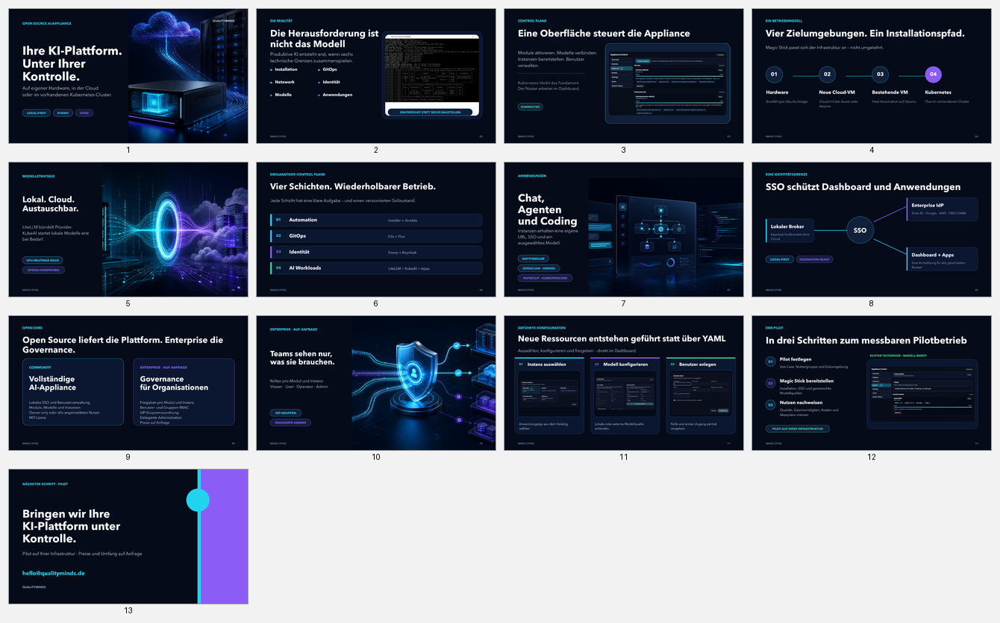

# Magic Stick Sales Deck

This folder contains the German sales deck for the AIppliance Magic Stick. It
positions the open source appliance, its local-first operating model, and the
optional enterprise governance package for customer and pilot conversations.

## Downloads

- [PowerPoint](Magic-Stick-Salesdeck-Dark-DE.pptx)
- [PDF](Magic-Stick-Salesdeck-Dark-DE.pdf)

## Storyline

The 13-slide deck covers:

1. the integration challenge behind productive AI;
2. one dashboard for the appliance control plane;
3. hardware, cloud VM, existing VM, and Kubernetes installation paths;
4. local, cloud, and hybrid model operation through LiteLLM;
5. declarative platform layers, applications, and local-first SSO;
6. the open core boundary and enterprise governance option;
7. guided creation of instances, models, and users;
8. a measurable pilot path on customer-controlled infrastructure.

The public repository and its focused documentation remain the technical
source of truth. The deck is sales collateral and must not be used as an
operational contract.

## Maintenance

Keep the PowerPoint and PDF versions synchronized. When the story or product
screens change, refresh `preview.png`, verify all slides visually, and retain
only public-safe example values and cropped product captures without personal
or deployment-specific information.
