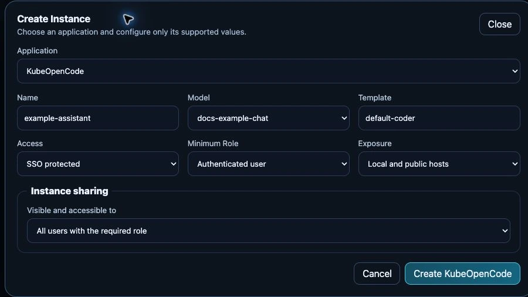

# Create and open applications

## Before you start

You need Operator or Administrator access to provision services. Application users
receive only the instances allowed by their role and sharing policy. Have a ready
model when the selected application needs inference.

## Create an instance

1. Open **Services**. **Applications**, **AI Runtime** and **Platform** describe
   different kinds of components, not separate installation products.
2. Choose the application and create an instance. Fill only the fields offered by
   its catalog-backed form; required modules are reconciled by the platform.
3. Review model selection, storage, access requirements and generated local/public URLs.
4. Wait for the instance to be ready, then open its discovered URL.

*Unsubmitted test-appliance form, 24 September 2026. The selected model is the
documentation test model; the neutral instance name is only a draft. No
application or access-policy change was submitted for this capture.*

Use **Credentials** only when the application exposes a credential panel and your
role permits access. A URL being present does not bypass SSO or instance access rules.
See [sharing](sharing.md) to grant selected users or groups access.

## Stop or remove components safely

Review instance dependencies and persistent-data retention before removing a
service. Disabling a shared runtime can affect several applications. Back up
databases and documents before destructive changes; deleting an instance is not
a backup mechanism.

## Verify

Open the application as an intended user, make a small request and verify its
chosen model. For a failure, inspect the instance status before changing generated
Helm resources manually. See [application troubleshooting](../administration/troubleshooting/applications.md)
and [configuration reference](../reference/application-controls.md).
