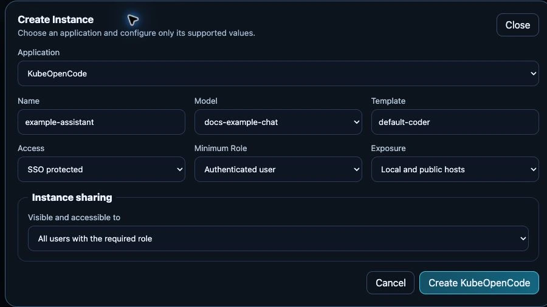

# Create and open applications

## Before you start

You need Operator or Administrator access to provision services. Application users
receive only the instances allowed by their role and sharing policy. Have a ready
model when the selected application needs inference.

## Create an instance

1. Open **Services**. **Applications**, **AI Runtime** and **Platform** describe
   different kinds of components, not separate installation products.
2. Choose the application and create an instance. Fill only the fields offered by
   its catalog-backed form; required modules are reconciled by the platform.
3. Review model selection, storage, access requirements and generated local/public URLs.
4. Wait for the instance to be ready, then open its discovered URL.

*Unsubmitted test-appliance form, 24 September 2026. The selected model is the
documentation test model; the neutral instance name is only a draft. No
application or access-policy change was submitted for this capture.*

Use **Credentials** only when the application exposes a credential panel and your
role permits access. A URL being present does not bypass SSO or instance access rules.
See [sharing](sharing.md) to grant selected users or groups access.

## OpenClaw, KubeOpenCode and AnythingLLM

Choose a chat model when creating an OpenClaw or KubeOpenCode instance. Each
instance keeps its selection when the shared catalog or global default changes.
If that model becomes unavailable, select a replacement explicitly. OpenClaw's
compaction budget follows the chosen model's context limit.

AnythingLLM is enabled directly from its service card. Before enabling it, open
**Services → AnythingLLM → Configure** and choose **Chat model** and
**Embedding model**. Each list offers the available models for that task. You
can register several models and choose one initial default for each purpose.
Leave a list on **Use catalog default** to follow the catalog's initial choice.
A missing saved selection must be replaced or reset before enabling the service.

The choices initialize a fresh installation: Chat answers questions; Embedding
prepares documents for search. Chat requires an available model; document
indexing also needs an embedding model. After setup, change preferences in
AnythingLLM itself. Its saved choices survive restarts and catalog updates and
take precedence over these initial defaults. Keep an existing index's embedding
model unless you plan to reindex the documents. Before upgrading an older installation, an
administrator must complete the
[settings migration](../administration/updates-rollback.md#anythingllm-persistent-settings-migration).

## Hermes

Choose a ready chat model when creating a Hermes instance in **Services**.
The current Hermes release requires at least 64,000 context tokens; use a model
with that actual configured capacity. A smaller or unknown context appears as
an instance status error.
Its browser link opens the Hermes dashboard through the existing SSO access
controls. Change the managed model in the instance settings; the operator owns
that configuration, so editing Hermes' native configuration file is not a
supported way to change it. Workspaces and sessions remain on the instance's
persistent volume. See the [configuration reference](../reference/application-controls.md).

## Paperclip

Create a Paperclip instance in **Services**, choose the default chat model and
review storage and the concurrent-agent limit. Open its browser link once it
is ready, then create companies, tasks and agents in Paperclip. OpenCode agents
use isolated Kubernetes sandboxes and keep their own explicit model choices.
The instance upgrades its Kubernetes plugin before its browser link becomes
ready; the first installation and a plugin upgrade require npm access. Ordinary
restarts reuse the installed plugin.

The current OpenCode sandbox image supports AMD64 only. Gateway selections in
the instance form are stored preferences; configuring gateway agents and their
credentials in Paperclip remains manual. See the
[Paperclip execution guide](../reference/paperclip-agents.md) for compatibility,
workspace persistence and upgrade limits.

## Pi Coding Agent

Pi is a coding agent for the terminal. Magic Stick provides its Pi 1.0.0 interface
in your browser, with the same SSO and instance-sharing controls as other applications.

1. In **Services**, enable **Pi Coding Agent** and wait for its required services
   to be ready. Deploy a chat model first if none is available.
2. Choose **New Instance**, set a name and model, and review access and exposure.
   **Configure** lets you change the default 5 GiB storage allocation.
3. Wait for **Ready**, then open the instance URL. The first start downloads the
   pinned Pi and browser-terminal releases, so GitHub access is required.
4. Ask Pi to work on a project, or use its `!` shell commands to clone a repository
   into the workspace. `/new` starts a new conversation; `/resume` selects a saved one.

The workspace, Pi settings, provider sign-ins and sessions survive Pod restarts.
Reopening the terminal continues the latest conversation. Each instance accepts
one browser connection at a time; users with access share its files, sessions and
runtime credentials. Give access to trusted users, and create separate instances
for separate workspaces. Pi's tools can execute commands inside its container;
they do not receive host mounts or a Kubernetes API credential.

Removing a Pi instance keeps its data volume. Recreating the same instance name
reuses it; an administrator must explicitly remove the retained volume to erase it.
See [Pi configuration](../reference/application-controls.md#pi-coding-instances)
for runtime requirements and model behavior.

## Stop or remove components safely

Review instance dependencies and persistent-data retention before removing a
service. Disabling a shared runtime can affect several applications. Back up
databases and documents before destructive changes; deleting an instance is not
a backup mechanism.

## Verify

Open the application as an intended user, make a small request and verify its
chosen model. For a failure, inspect the instance status before changing generated
Helm resources manually. See [application troubleshooting](../administration/troubleshooting/applications.md)
and [configuration reference](../reference/application-controls.md).
