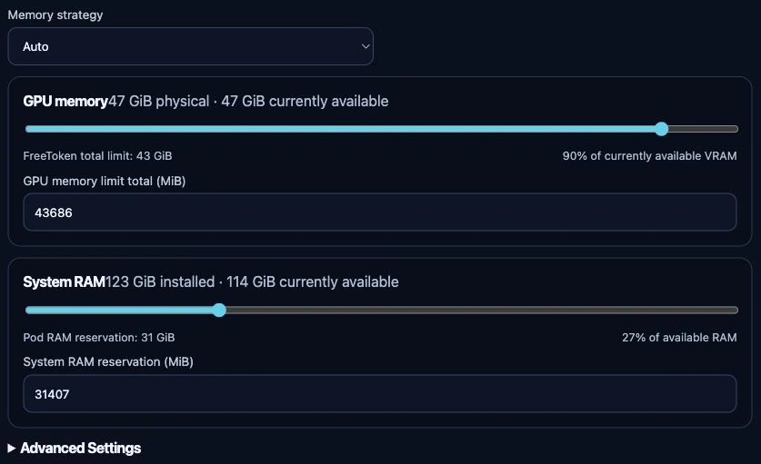

# Run a FreeToken model

## Before you start

FreeToken has a narrower hardware/model policy than the other engines. Read the
generated [compatibility matrix](../../reference/compatibility.md). The current
adapter uses whole homogeneous NVIDIA GPUs on one node, not MIG or time-slicing
slots. Unsupported devices are disabled with their reason.

Use a model artifact admitted by the catalog and a promoted FreeToken runtime.
Do not assume that every repository returned by Hugging Face is a valid FreeToken model.

## Create with automatic settings

1. Open **Models → Create**, choose **FreeToken**, then an eligible node/GPU allocation.
2. Search and select a supported checkpoint. Confirm its exact repository and artifact.
3. Choose the number of physical GPUs when the model supports tensor parallelism.
4. Keep **Memory strategy → Auto** for the initial test.
5. Review **GPU memory** and **System RAM**. Do not reserve all host memory;
   leave room for the platform and other workloads. Unknown live capacity must be
   fixed before a meaningful budget can be selected.
6. Keep **Advanced Settings** closed unless adjusting context, concurrency, cache
   or a documented runtime setting for a specific reason.
7. Create the model and use **Logs** to follow initialization. Verify with a small
   request through the common [API endpoint](../api-access.md).

*Unsubmitted test-appliance form, 24 September 2026. No model was selected or
created for this capture. The displayed capacities and initial budgets belong to
this test device; they are not recommended settings or evidence that a particular
checkpoint fits. Review both budgets after choosing your model.*

## What the memory controls mean

- GPU memory is the total planned budget across the selected GPUs. At runtime it
  is checked against the free memory on each assigned device; it is not an isolated
  hardware-enforced VRAM partition.
- System RAM is the Pod's resource policy, not a FreeToken CLI flag that limits
  every host process. The default is a starting point, not a promise that a large
  offloaded checkpoint fits.
- Model downloads and conversion also require disk space. FreeToken's temporary
  cache disappears when its Pod is removed.

The strategies and advanced fields are catalog-driven. Do not copy vLLM offload
flags or Ollama KV-cache settings into this engine. See [configuration mapping](../../reference/freetoken.md).

## If startup fails

Read the first actionable runtime error in **Logs**, not only the Deployment
timeout. Missing CUDA assignment, insufficient free VRAM, Pod RAM exhaustion and
disk exhaustion need different fixes. See [FreeToken troubleshooting](../../administration/troubleshooting/freetoken.md).
Start/stop/restart use the normal [model lifecycle](manage.md).
