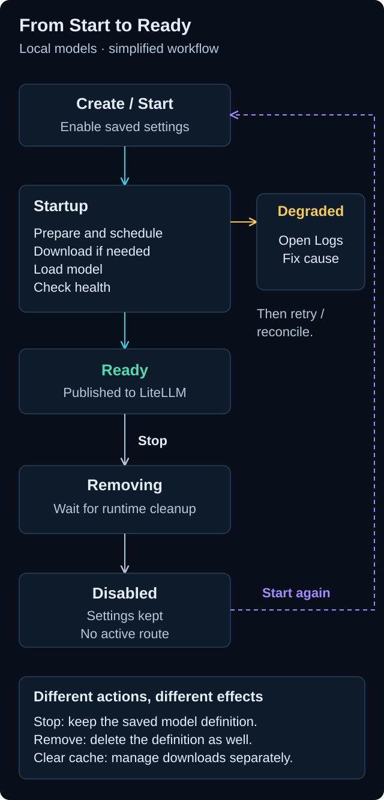
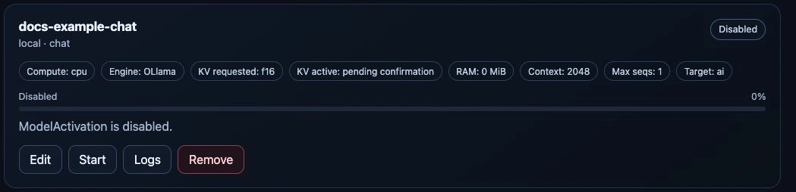
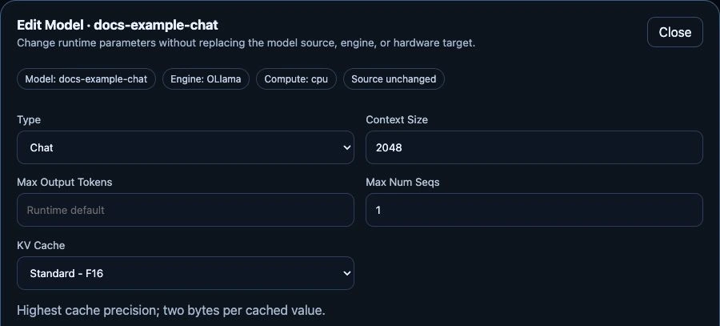

# Manage deployed models

## Before you start

Open **Models** with Operator or Administrator access. Check whether applications
or mesh consumers are using a model before interrupting it. Catalog-only models
without a Magic Stick activation can be read-only.

| Action | What happens |
|---|---|
| Edit | Opens the saved configuration. Review and save supported changes; runtime-affecting changes can reload the model. |
| Stop | Retains the model definition but disables it. Local runtime resources are removed and routes withdrawn. |
| Start | Recreates the runtime from its saved settings and republishes the route only when ready. |
| Restart | Where offered, restarts the existing engine runtime without creating a second model definition. |
| Logs | Shows bounded logs from the selected activation's local Pods/containers, including startup failures. |
| Remove | Deletes the model activation and its managed runtime. This is not the same as clearing downloaded caches. |

*Live test-appliance capture, 24 September 2026. This small, owner-authorized
test model illustrates the controls; its parameters are not sizing recommendations.*

The common **Start/Stop** workflow covers Ollama, vLLM, FreeToken, Realtime and
external activations. For external models it changes local routing only.
Restart controls depend on the engine; Stop followed by Start is the common
reload workflow when no separate Restart action is offered.

## Understand the lifecycle

*A simplified local-model workflow, not an exhaustive state machine.
Open the diagram for full-size labels.*

Startup includes dependency preparation, scheduling, any necessary downloads,
model loading and health checks. Exact progress labels vary by engine. A failure
can report **Degraded** during startup or after a model was ready: use **Logs**
and the status message to identify the cause before retrying. Some temporary
conditions recover through automatic reconciliation.

**Stop** retains the saved settings. Resources are released only after the runtime
and its allocations have terminated. **Remove** also deletes the model definition;
neither action is a substitute for [cache cleanup](../../administration/model-cache.md).
For external models, Start and Stop control local routing, not the remote provider.

## Stop and start again

Choose **Stop** on the model card and wait for **Disabled**. The button then
changes to **Start**. Starting uses the saved configuration; you do not need to
find the checkpoint or enter its parameters again.

*The same test model after Stop, 24 September 2026. The displayed RAM reservation
has been released; the model definition and its configured budget are retained.*

## Edit runtime parameters

Choose **Edit**, adjust the supported fields, and review the memory budget before
selecting **Save changes**. The model source, engine and hardware target remain
unchanged in this dialog. Saving runtime-affecting settings can restart the model.

*Unchanged editing form for the stopped test model, 24 September 2026. This crop
shows the main parameters; memory controls and the save action continue below.
No edits were saved for this capture.*

## Check the result

Stop passes through removal while Pods and GPU allocations terminate. Memory and
slots may not become free immediately. Start can download weights again, especially
for temporary FreeToken caches. **Ready** means routable; test an inference request
before returning the model to users.

If another administrator changed the model while you were editing, refresh the
configuration instead of overwriting a stale revision. Changing engine-specific
settings must not silently carry incompatible fields to another engine.

For failures, read [model diagnostics](../../administration/troubleshooting/models.md).
For disk cleanup, use [model cache management](../../administration/model-cache.md),
not manual deletion of running Pods or files.
